# Authentication vulnerabilities

> 

## What is authentication?

> Authentication là quá trình xác minh danh tính của một user. Có 3 yếu tố xác thực khác nhau:
>
> - Mật khẩu
> - Mã di động (Điện thoại)
> - Sinh trắc học, hành vi

---

## What is the difference between authentication and authorization?

> Authentication là quá trình xác minh user xem có phải đúng là user mà học tuyên bố hay không, trong khi authorization là việc xác minh xem user có được ủy quyền làm việc đó hay không.

---

## Cách phát sinh lỗ hổng:

> 2 Cách phát sinh:
>
> - Authen yếu -> dễ bị brute force
> - Logic vul hay mã hóa yếu

---

## Tác động

> Sau khi xâm nhập được vào hệ thống, attacker sẽ có toàn quyền truy cập vào dữ liệu, chức năng, xâm phạm account đó

---

## Phân loại

### Vulnerabilities in password-based login

#### Brute-force attacks

> Tấn công brute-force là khi kẻ tấn công sử dụng hệ thống thử và sai để cố gắng đoán thông tin đăng nhập hợp lệ của người dùng. Các cuộc tấn công này thường được tự động hóa bằng cách sử dụng danh sách từ gồm tên người dùng và mật khẩu. Tự động hóa quy trình này, đặc biệt là sử dụng các công cụ chuyên dụng, có khả năng cho phép kẻ tấn công thực hiện rất nhiều lần đăng nhập ở tốc độ cao.

> Brute-force không phải lúc nào cũng chỉ là một trường hợp phỏng đoán hoàn toàn ngẫu nhiên về tên người dùng và mật khẩu. Cũng bằng cách sử dụng logic cơ bản hoặc kiến ​​thức có sẵn công khai, những kẻ tấn công có thể tinh chỉnh các cuộc tấn công bạo lực để đưa ra các phỏng đoán có học thức hơn nhiều. Điều này làm tăng đáng kể hiệu quả của các cuộc tấn công như vậy. Các trang web dựa vào đăng nhập dựa trên mật khẩu làm phương pháp xác thực người dùng duy nhất của chúng có thể rất dễ bị tấn công nếu chúng không thực hiện đầy đủ biện pháp bảo vệ bạo lực.

---

##### Brute-forcing usernames

> Tên người dùng đặc biệt dễ đoán nếu chúng tuân theo một mẫu dễ nhận biết, chẳng hạn như địa chỉ email. Ví dụ: rất thường thấy các thông tin đăng nhập doanh nghiệp ở định dạng firstname.lastname@somecompany.com. Tuy nhiên, ngay cả khi không có khuôn mẫu rõ ràng, đôi khi ngay cả những tài khoản có đặc quyền cao cũng được tạo bằng cách sử dụng tên người dùng có thể dự đoán được, chẳng hạn như quản trị viên hoặc quản trị viên.

> Trong quá trình kiểm tra, hãy kiểm tra xem trang web có tiết lộ tên người dùng tiềm năng một cách công khai hay không. Ví dụ: bạn có thể truy cập hồ sơ người dùng mà không cần đăng nhập không? Ngay cả khi nội dung thực tế của hồ sơ bị ẩn, tên được sử dụng trong hồ sơ đôi khi giống với tên người dùng đăng nhập. Bạn cũng nên kiểm tra phản hồi HTTP để xem có địa chỉ email nào bị tiết lộ hay không. Đôi khi, phản hồi chứa địa chỉ email của những người dùng có đặc quyền cao như quản trị viên và bộ phận hỗ trợ CNTT.

---

##### Brute-forcing passwords

> Mật khẩu cũng có thể bị ép buộc một cách thô bạo, với độ khó thay đổi tùy theo độ mạnh của mật khẩu. Nhiều trang web áp dụng một số hình thức chính sách mật khẩu, buộc người dùng phải tạo mật khẩu có độ entropy cao, ít nhất về mặt lý thuyết, khó bị bẻ khóa chỉ bằng cách sử dụng brute-force. Điều này thường liên quan đến việc thực thi mật khẩu với:
>
> - Số lượng ký tự tối thiểu
> - Hỗ hợp chữ thường, chữ hoa
> - ít nhất một ký tự đặc biệt

> Tuy nhiên, trong khi mật khẩu có độ phức tạp cao rất khó để máy tính có thể bẻ khóa, chúng ta có thể sử dụng kiến ​​thức cơ bản về hành vi của con người để khai thác các lỗ hổng mà người dùng vô tình đưa vào hệ thống này. Thay vì tạo một mật khẩu mạnh với sự kết hợp ngẫu nhiên của các ký tự, người dùng thường lấy một mật khẩu mà họ có thể nhớ được và cố gắng làm cho nó phù hợp với chính sách mật khẩu. Ví dụ: nếu mật khẩu không được phép, người dùng có thể thử một cái gì đó như `Mypassword1!` hoặc `Myp4 $$ w0rd` thay thế.s

> Trong trường hợp chính sách yêu cầu người dùng thay đổi mật khẩu của họ thường xuyên, người dùng cũng thường chỉ thực hiện những thay đổi nhỏ, có thể dự đoán được đối với mật khẩu ưa thích của họ. Ví dụ, Mypassword1! trở thành Mypassword1? hoặc Mypassword2 !.

> Kiến thức về các thông tin xác thực có thể xảy ra và các mẫu có thể dự đoán được có nghĩa là các cuộc tấn công brute-force thường có thể phức tạp hơn nhiều và do đó hiệu quả hơn là chỉ lặp đi lặp lại mọi tổ hợp ký tự có thể có.

---

##### Username enumeration

> Liệt kê tên người dùng là khi kẻ tấn công có thể quan sát những thay đổi trong hành vi của trang web để xác định xem tên người dùng nhất định có hợp lệ hay không.

> Việc liệt kê tên người dùng thường xảy ra trên trang đăng nhập, ví dụ: khi bạn nhập tên người dùng hợp lệ nhưng mật khẩu không chính xác hoặc trên các biểu mẫu đăng ký khi bạn nhập tên người dùng đã được sử dụng. Điều này làm giảm đáng kể thời gian và nỗ lực cần thiết để bắt buộc đăng nhập vì kẻ tấn công có thể nhanh chóng tạo ra một danh sách rút gọn các tên người dùng hợp lệ.

> Trong khi cố gắng cưỡng bức trang đăng nhập, bạn nên đặc biệt chú ý đến bất kỳ sự khác biệt nào trong:
>
> - `Status code`: Trong một cuộc tấn công brute-force, mã trạng thái HTTP trả về có thể giống nhau đối với phần lớn các phỏng đoán vì hầu hết chúng đều sai. Nếu một phỏng đoán trả về một mã trạng thái khác, đây là một dấu hiệu mạnh mẽ cho thấy tên người dùng là chính xác. Cách tốt nhất là các trang web luôn trả về cùng một mã trạng thái bất kể kết quả như thế nào, nhưng thực tế này không phải lúc nào cũng được tuân thủ.
> - `Error messages`: Đôi khi thông báo lỗi trả về khác nhau tùy thuộc vào việc cả tên người dùng VÀ mật khẩu đều không chính xác hay chỉ có mật khẩu không chính xác. Cách tốt nhất là các trang web nên sử dụng các thông báo giống nhau, chung chung trong cả hai trường hợp, nhưng các lỗi đánh máy nhỏ đôi khi xuất hiện. Chỉ một ký tự không đúng vị trí sẽ khiến hai thông báo trở nên khác biệt, ngay cả trong trường hợp ký tự không hiển thị trên trang được hiển thị.
> - `Response time`: Nếu hầu hết các yêu cầu được xử lý với thời gian phản hồi tương tự, bất kỳ yêu cầu nào khác với điều này cho thấy có điều gì đó khác biệt đang xảy ra ở hậu trường. Đây là một dấu hiệu khác cho thấy tên người dùng được đoán có thể đúng. Ví dụ: một trang web chỉ có thể kiểm tra xem mật khẩu có đúng hay không nếu tên người dùng hợp lệ. Bước bổ sung này có thể làm tăng một chút thời gian phản hồi. Điều này có thể là tinh tế, nhưng kẻ tấn công có thể làm cho sự chậm trễ này rõ ràng hơn bằng cách nhập một mật khẩu quá dài mà trang web cần nhiều thời gian hơn để xử lý.

#### Lab: Username enumeration via different responses

> Des: Phòng thí nghiệm này dễ bị tấn công bởi kiểu liệt kê tên người dùng và mật khẩu. Nó có một tài khoản với tên người dùng và mật khẩu có thể dự đoán được, có thể tìm thấy trong danh sách từ sau:

> - [Candidate usernames](https://portswigger.net/web-security/authentication/auth-lab-usernames)
> - [Candidate passwords](https://portswigger.net/web-security/authentication/auth-lab-passwords)

> Để giải phòng thí nghiệm, hãy liệt kê một tên người dùng hợp lệ, brute-ép mật khẩu của người dùng này, sau đó truy cập trang tài khoản của họ.

> Bài này vào rồi đăng nhập bình thường, chặn và gửi request đăng nhập qua `intruder` và add payloads:
> 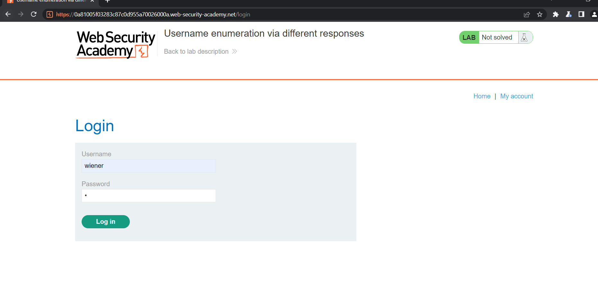 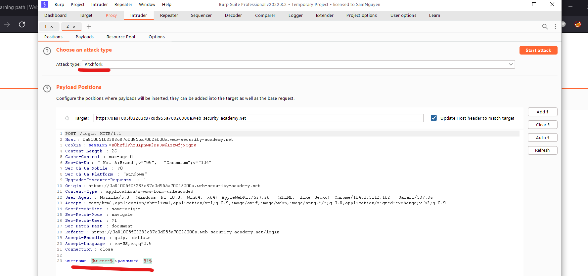

> Sau khi paste passwd và user được cho trước sẽ attack và thấy được các response khác là `user invalid`, thấy riêng 1 response là `passwd invalid` với `length` khác:
> 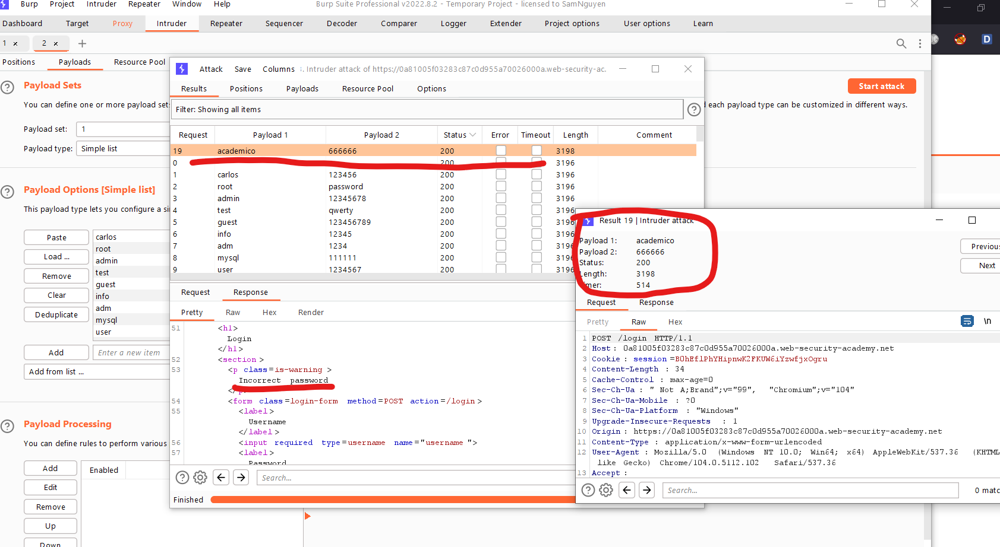

> Lấy nó và làm lại:
> 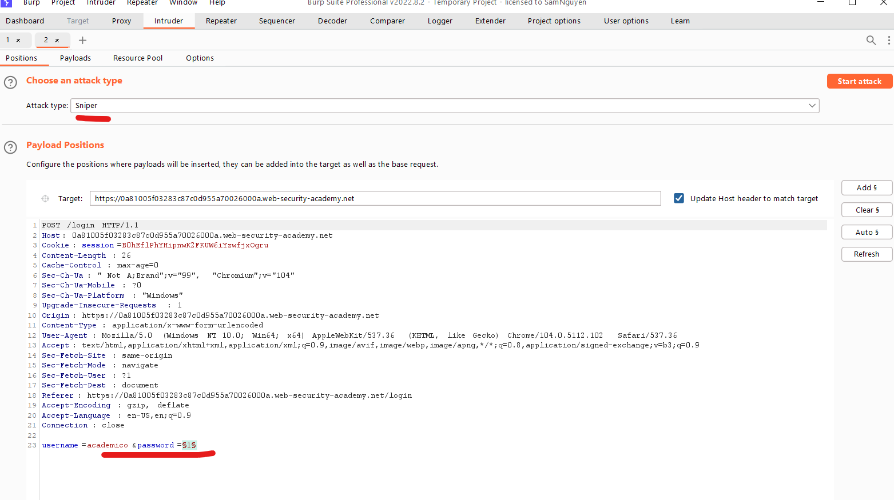 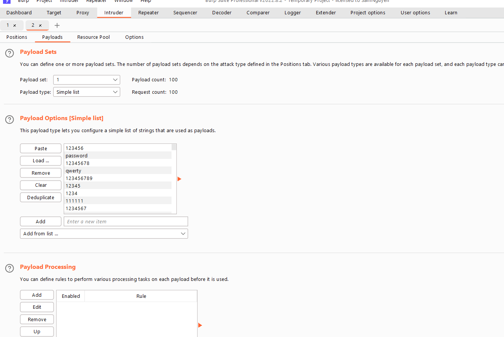 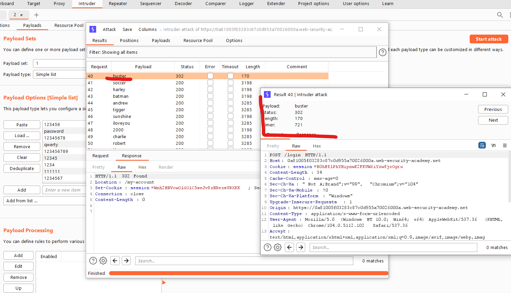 

---

#### Lab: Username enumeration via subtly different responses

> Des: Phòng thí nghiệm này rất dễ bị tấn công bởi các cuộc tấn công liệt kê tên người dùng và mật khẩu. Nó có một tài khoản với tên người dùng và mật khẩu có thể dự đoán được, có thể tìm thấy trong danh sách từ sau:

> - [Candidate usernames](https://portswigger.net/web-security/authentication/auth-lab-usernames)
> - [Candidate passwords](https://portswigger.net/web-security/authentication/auth-lab-passwords)

> Bài này là tìm sự khác nhau giữa `username` loggin đúng và sai nhờ `response` từ `request`:

> Vì nó ghi là mk or tk sai nên không thể truy xuất được user nào đúng để exploit
> 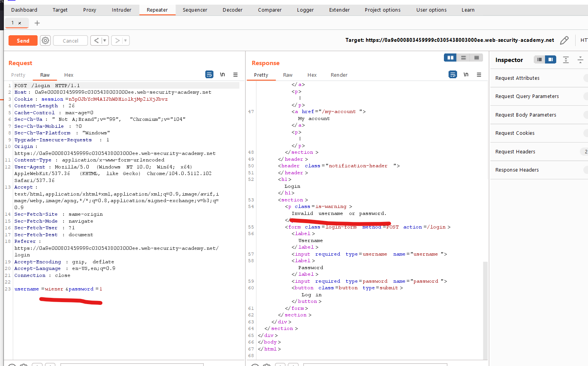

> Lần này chỉ add payload vào username thôi:
> 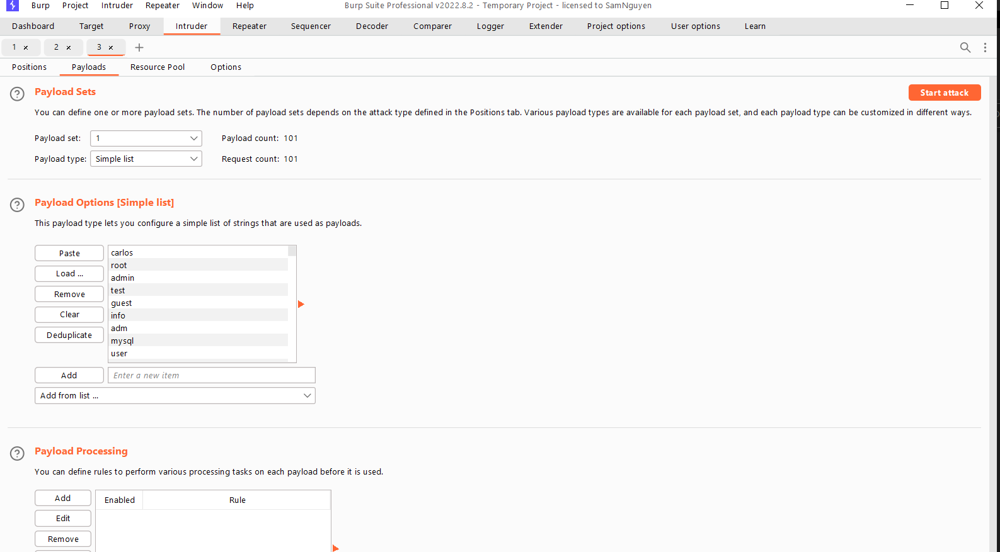
>
> Sau đó add thêm `Grep-Extract` để nó lọc các response với nhau:
> 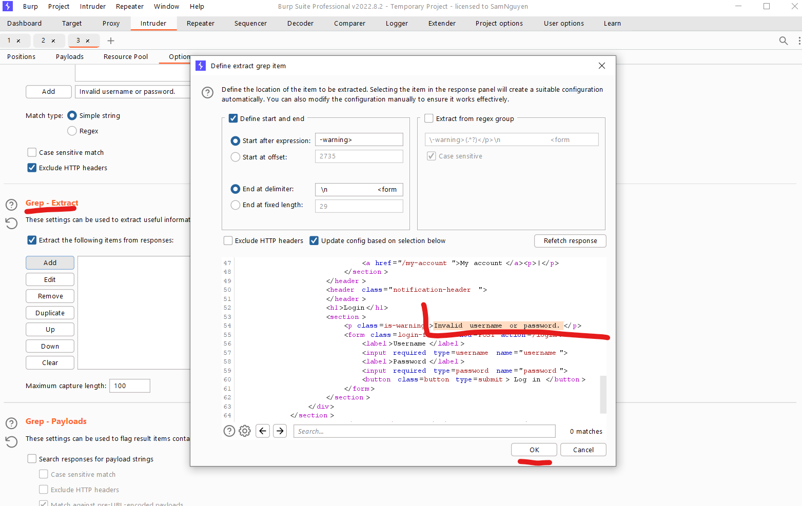
>
> Thấy sự khác nhau là không có dấu `.`:
> 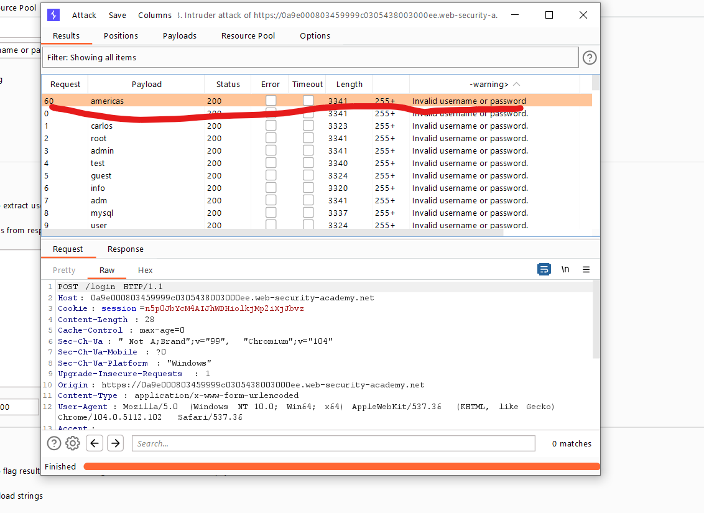

> Làm lại và add payload là passwd:
> 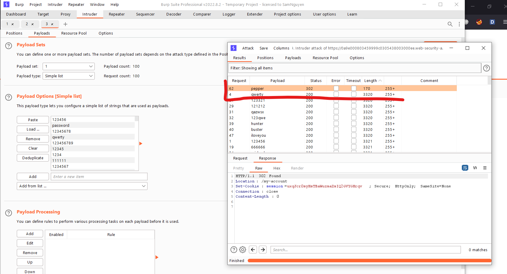 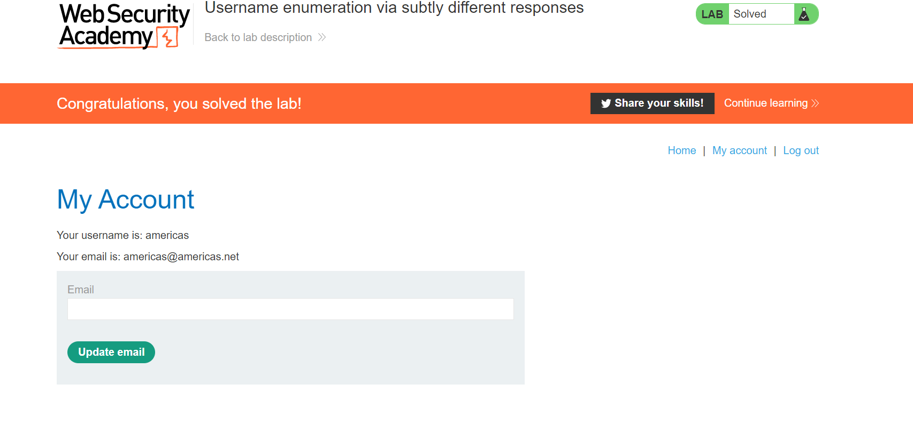

#### Lab: Username enumeration via response timing

> Des: Phòng thí nghiệm này dễ bị liệt kê tên người dùng bằng cách sử dụng thời gian phản hồi của nó. Để giải phòng thí nghiệm, hãy liệt kê một tên người dùng hợp lệ, brute-ép mật khẩu của người dùng này, sau đó truy cập trang tài khoản của họ.
