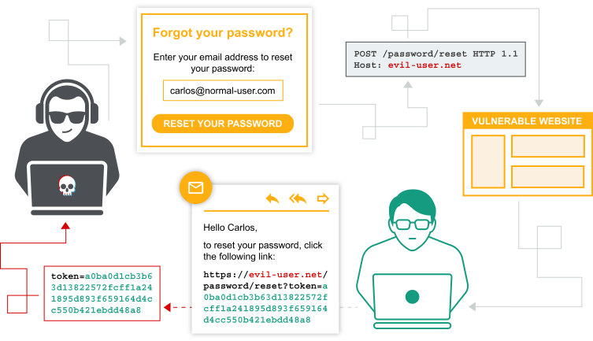

# Authentication vulnerabilities

> 

## What is authentication?

> Authentication là quá trình xác minh danh tính của một user. Có 3 yếu tố xác thực khác nhau:
>
> - Mật khẩu
> - Mã di động (Điện thoại)
> - Sinh trắc học, hành vi

---

## What is the difference between authentication and authorization?

> Authentication là quá trình xác minh user xem có phải đúng là user mà học tuyên bố hay không, trong khi authorization là việc xác minh xem user có được ủy quyền làm việc đó hay không.

---

## Cách phát sinh lỗ hổng:

> 2 Cách phát sinh:
>
> - Authen yếu -> dễ bị brute force
> - Logic vul hay mã hóa yếu

---

## Tác động

> Sau khi xâm nhập được vào hệ thống, attacker sẽ có toàn quyền truy cập vào dữ liệu, chức năng, xâm phạm account đó

---

## Phân loại

### Vulnerabilities in password-based login
