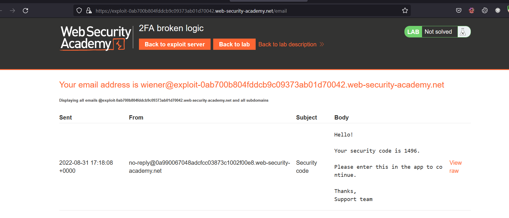

# Business logic vulnerabilities

## Khái niệm

> Phát sinh do những sai lầm từ user
> 

## What are business logic vul?

> Là những vul trong design và implement của 1 app cho phép attacker gây ra các behavior ngoài ý muốn.
>
> Logic flaws thường không thể thấy đối với những người không tìm kiếm một các rõ ràng vì chúng không thể bị lộ khi sử dụng app bình thường

> Ví dụ:
> hoàn thành 1 đơn hàng giao dịch mà không cần thông qua quy trình mua hàng

## Phát sinh như nào?

> Phát sinh cho đội ngũ design, implement đưa ra các giả định sai về cách user tương tác với app. Giả định này sẽ không tốt dẫn đến xác nhận không đầy đủ info từ user.

## Tác động

> Khá nhỏ

## Ví dụ

### Excessive trust in client-side controls (Tin tưởng quá mức vào các kiểm soát phía máy khách)

> Giả định cơ bản, người dùng tương tác qua giao diện trang web. Nó vẫn nguy hiểm vì có thể dùng các tool như `burp proxy` để chặn và sửa request

#### Lab: Excessive trust in client-side controls

> Des:Lab không xác thực đầy đủ data từ user. Exploit và có thể mua hàng với giá không mong muốn. Để solve thì mua `Lightweight l33t leather jacket`
>
> Đăng nhập bằng `wiener:peter`

> Bài này chỉ cần dùng burp để chặn và sửa giá + id của sản phẩm:
>     

---

#### Lab: 2FA broken logic

> Des: Xác thực 2 yếu tố của lab này dễ bị attack. Để solve, truy cập vào account carlos
>
> Đăng nhập bằng `wiener:peter`

> Bài này khi đăng nhập thì cần xác thực 2 lần, thứ nhất là passwd, thứ 2 là mã opt 4 kí tự:
>  

> Để lấy mã thì cần với param `verify=user` 

> Sau đó sẽ gửi về mail, để xác thực thì `POST` nó lên đường dẫn vừa `GET` mã:
> 

> Giờ dùng `GET` để tạo 1 otp về user `carlos`:
> 

> Send `POST` qua intruder để brute force nó từ 1000 -> 9999, nó trả về `302` là oke. Copy tại `show response in broswer` :
>    

---

### Failing to handle unconventional input (Xử lý input không bình thường)

> Mục đính của application login là hạn chế input cảu user đối với các giá trị tuân thủ của các quy tắc kinh doanh
>
> Ví dụ: Ứng dụng có thể được thiết kế để chấp thuận một kiểu data nhất định nhưng login này có được chấp thuận của business hay

> Ví dụ: Một cửa hàng trực tuyến, khi đặt mua sp, ng dùng chỉ định số lượng họ muốn đặt. Nhưng phải đặt với số lượng cho phép, không quá số lượng của sp

> Chức năng chuyển tiền, phải xem người gửi đủ tiền trước khi hoàn thành
>
> ```
> $transferAmount = $_POST['amount'];
> $currentBalance = $user->getBalance();
>
> if ($transferAmount <= $currentBalance) {
>    // Complete the transfer
> } else {
>    // Block the transfer: insufficient funds
> }
> ```

> Sử dụng burp suite để chặn và sửa request xem nó có điều gì xảy ra không:
>
> - Có giới hạn cho data?
> - điều gì xảy ra khi đạt tới limit
> - có bất kỳ chuyển đổi, chuẩn hóa nào đang thực hiện>

#### Lab: High-level logic vulnerability

> Des: Không xác thực đầy đủ thông tin user, exploit logic vul trong quy trình mua hàng để mua mặt hàng với giá không mong muôn `lightweight l33t leather jacket`
>
> Login `wiener:peter`

> Khi đặt sản phẩm thì lab cho `quantity` là số âm được. Giờ cần bằng sao cho sản phẩm phải bằng số tiền đã cho là 100$
>   

---

#### Lab: Low-level logic flaw

> Des: Không xác thực đầy đủ thông tin user, exploit logic vul trong quy trình mua hàng để mua mặt hàng với giá không mong muôn `lightweight l33t leather jacket`
>
> Login `wiener:peter`

> Bài này sử dụng burp intruder để brute force xem limit của lab là gì. Không được đặt quá `99` số lương trên 1 lần đặt
>
> Tổng đơn hàng là không được quá: `2,147,483,647`

> Đầu tiên send POST của đặt hàng qua intruder:
> 

> Để check xem max của đơn hàng là bao nhiêu, nó bị lỗi lúc số âm, lúc dương, sau đó remove hết đi exploit lại
> 

>  

> Set payload như hình để attack:
>    

> Sau đó gửi 47 cái jacket để giảm số âm cho đủ rồi mua thêm đồ để thành số dương cho đủ 100$
>    
