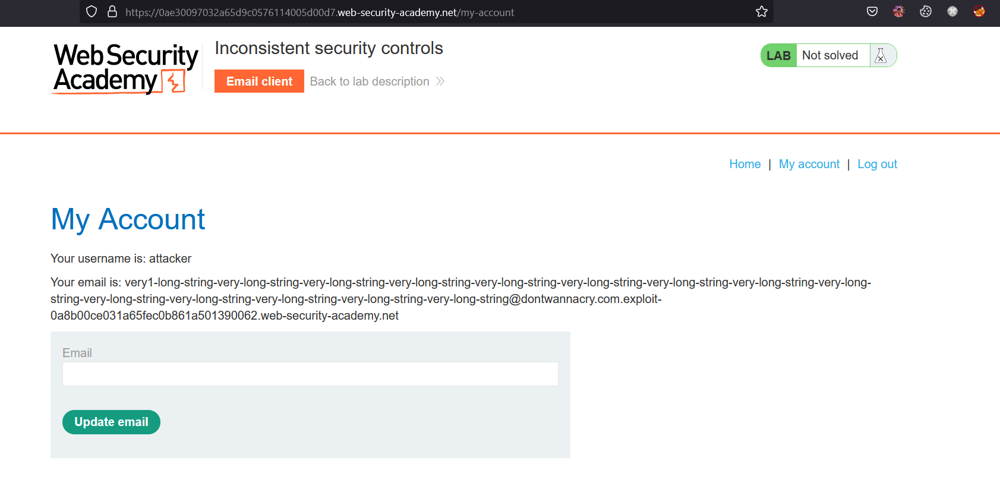
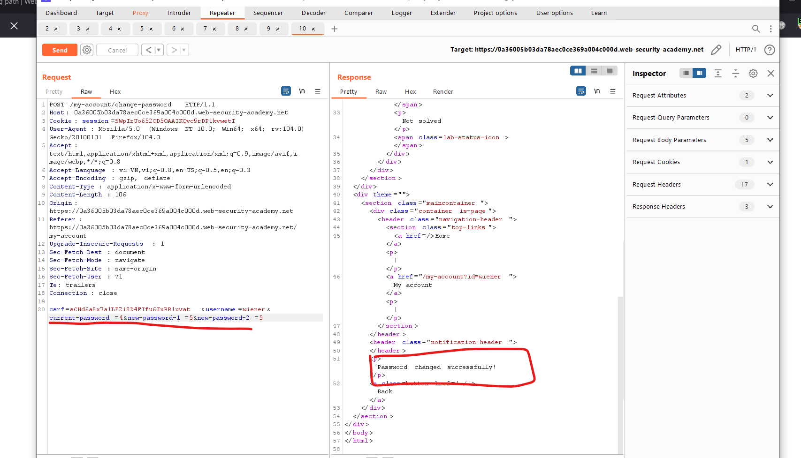
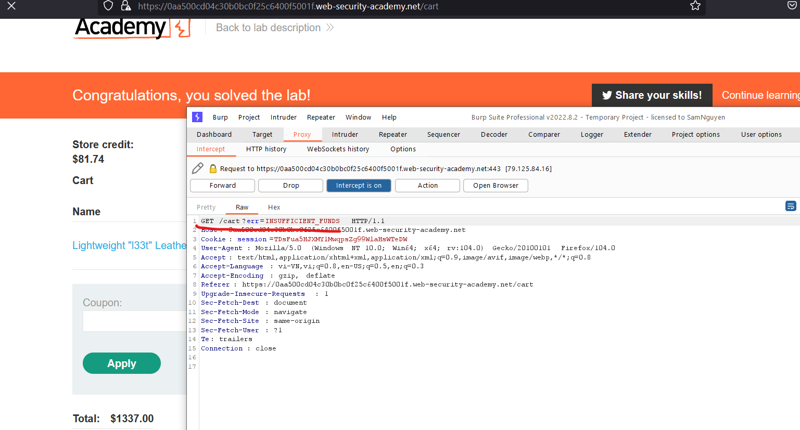
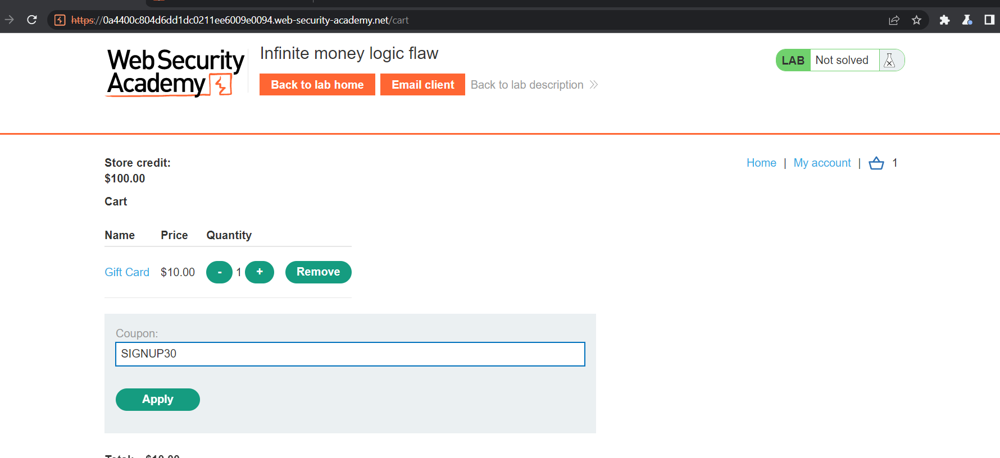
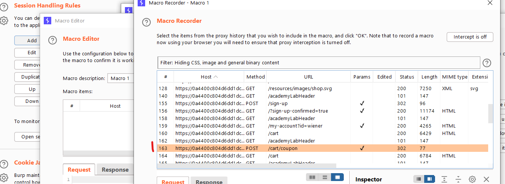
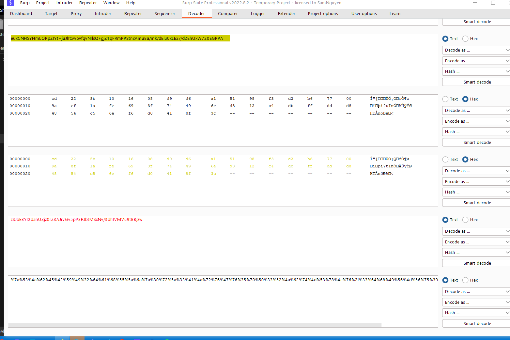

# Business logic vulnerabilities

## Khái niệm

> Phát sinh do những sai lầm từ user
> 

## What are business logic vul?

> Là những vul trong design và implement của 1 app cho phép attacker gây ra các behavior ngoài ý muốn.
>
> Logic flaws thường không thể thấy đối với những người không tìm kiếm một các rõ ràng vì chúng không thể bị lộ khi sử dụng app bình thường

> Ví dụ:
> hoàn thành 1 đơn hàng giao dịch mà không cần thông qua quy trình mua hàng

## Phát sinh như nào?

> Phát sinh cho đội ngũ design, implement đưa ra các giả định sai về cách user tương tác với app. Giả định này sẽ không tốt dẫn đến xác nhận không đầy đủ info từ user.

## Tác động

> Khá nhỏ

## Ví dụ

### Excessive trust in client-side controls (Tin tưởng quá mức vào các kiểm soát phía máy khách)

> Giả định cơ bản, người dùng tương tác qua giao diện trang web. Nó vẫn nguy hiểm vì có thể dùng các tool như `burp proxy` để chặn và sửa request

#### Lab: Excessive trust in client-side controls

> Des:Lab không xác thực đầy đủ data từ user. Exploit và có thể mua hàng với giá không mong muốn. Để solve thì mua `Lightweight l33t leather jacket`
>
> Đăng nhập bằng `wiener:peter`

> Bài này chỉ cần dùng burp để chặn và sửa giá + id của sản phẩm:
>     

---

#### Lab: 2FA broken logic

> Des: Xác thực 2 yếu tố của lab này dễ bị attack. Để solve, truy cập vào account carlos
>
> Đăng nhập bằng `wiener:peter`

> Bài này khi đăng nhập thì cần xác thực 2 lần, thứ nhất là passwd, thứ 2 là mã opt 4 kí tự:
>  

> Để lấy mã thì cần với param `verify=user` 

> Sau đó sẽ gửi về mail, để xác thực thì `POST` nó lên đường dẫn vừa `GET` mã:
> 

> Giờ dùng `GET` để tạo 1 otp về user `carlos`:
> 

> Send `POST` qua intruder để brute force nó từ 1000 -> 9999, nó trả về `302` là oke. Copy tại `show response in broswer` :
>    

---

### Failing to handle unconventional input (Xử lý input không bình thường)

> Mục đính của application login là hạn chế input cảu user đối với các giá trị tuân thủ của các quy tắc kinh doanh
>
> Ví dụ: Ứng dụng có thể được thiết kế để chấp thuận một kiểu data nhất định nhưng login này có được chấp thuận của business hay

> Ví dụ: Một cửa hàng trực tuyến, khi đặt mua sp, ng dùng chỉ định số lượng họ muốn đặt. Nhưng phải đặt với số lượng cho phép, không quá số lượng của sp

> Chức năng chuyển tiền, phải xem người gửi đủ tiền trước khi hoàn thành
>
> ```
> $transferAmount = $_POST['amount'];
> $currentBalance = $user->getBalance();
>
> if ($transferAmount <= $currentBalance) {
>    // Complete the transfer
> } else {
>    // Block the transfer: insufficient funds
> }
> ```

> Sử dụng burp suite để chặn và sửa request xem nó có điều gì xảy ra không:
>
> - Có giới hạn cho data?
> - điều gì xảy ra khi đạt tới limit
> - có bất kỳ chuyển đổi, chuẩn hóa nào đang thực hiện>

#### Lab: High-level logic vulnerability

> Des: Không xác thực đầy đủ thông tin user, exploit logic vul trong quy trình mua hàng để mua mặt hàng với giá không mong muôn `lightweight l33t leather jacket`
>
> Login `wiener:peter`

> Khi đặt sản phẩm thì lab cho `quantity` là số âm được. Giờ cần bằng sao cho sản phẩm phải bằng số tiền đã cho là 100$
>   

---

#### Lab: Low-level logic flaw

> Des: Không xác thực đầy đủ thông tin user, exploit logic vul trong quy trình mua hàng để mua mặt hàng với giá không mong muôn `lightweight l33t leather jacket`
>
> Login `wiener:peter`

> Bài này sử dụng burp intruder để brute force xem limit của lab là gì. Không được đặt quá `99` số lương trên 1 lần đặt
>
> Tổng đơn hàng là không được quá: `2,147,483,647`

> Đầu tiên send POST của đặt hàng qua intruder:
> 

> Để check xem max của đơn hàng là bao nhiêu, nó bị lỗi lúc số âm, lúc dương, sau đó remove hết đi exploit lại
> 

>  

> Set payload như hình để attack:
>    

> Sau đó gửi 47 cái jacket để giảm số âm cho đủ rồi mua thêm đồ để thành số dương cho đủ 100$
>    

---

#### Lab: Inconsistent handling of exceptional input

> Des: Không xác thực đầy đủ thông tin user. Lấy quyền admin và xóa user carlos

> 

> Bài này khi register xong cũng không thấy gì để exploit. Dùng burp để quét xem path `/admin`:
>  

> Vào path `/admin` thì nó bắt là phải mang domamin `dontwannaycry.com` thì mới làm được quyền admin:
> 

> Thử register nhiều ký tự với email xem sao, nếu quá 256 thì nó sẽ bị cắt:
> 

> Nên để exploit thì sẽ đăng kí với email dài + `@dontwannacry.com` + `.email-id.web-security-academy.net` > 

> Do thừa nên đăng kí lại:
> 

> Done:
> 

---

### Making flawed assumptions about user behavior (Giả định sai làm về hành vi user)

#### Trusted users won't always remain trustworthy ( Người dùng nào không phải lúc nào cũng tin cậy)

> Khi đã pass qua các kiểm soát nghiêm ngặt rồi, dữ liệu của user được tin cậy vô thời hạn

#### Lab: Inconsistent security controls

> Lab này cho phép user access vào chức năng administrator dành cho nhân viên. Truy cập và xóa `carlos`

> Bài này là về tin tưởng vô thời hạn nên exploit như bài trước thì không được:
> 

> Vì là không nên tin tưởng nên change email thành subdomain của công ty luôn xem sao mà lại solve được luôn =)):
> 

---

#### Users won't always supply mandatory input (Người dùng không phải lúc nào cũng cung cấp thông tin đầu vào bắt buộc)

> Luôn cung cấp giá trị cho trường bắt buộc. user bình thường sẽ không thể gửi kèm các trường không bắt buộc, nhưng attacker thì khác, có thể giả mạo chúng

> Khi thăm dò lỗi logic, thử bỏ từng param và quan sát xem có ảnh hưởng gì tới response:
>
> - Chỉ xóa 1 param tại 1 time để đảm bảo được tất cả các path có liên quan
> - Xóa thử param + tham số. Máy chủ sẽ xem xét và xử lý 2 trường hợp
> - Thực hiện nhiều quá trình cho tới khi hoàn thành

> Áp dụng cho URL và POST, kiểm tra thêm cả cookie

#### Lab: Weak isolation on dual-use endpoint

> Des:Đưa ra 1 giả định sai lầm về đặc quyền của user dựa trên thông tin đầu vào của họ. exploit tính năng quản lý tài khoản để có quyền truy cập vào account của user. Xóa carlos. Login bằng `wiener:peter`

> Bài này thì đầu tiên thử quét các path xem sao:
> 

> Thử đổi passwd:
> 

> Chall này bảo xóa từ param đi và thử xem server trả về gì. Ban đầu thử xóa tham số của `current-password` thì lỗi, k đổi được. Xong xóa cả param + tham số đi thì vẫn change được. Chứng tỏ không cần param `current-password` thì vẫn đổi được pass -> đổi luôn của administrator:
>   

---

#### Lab: Password reset broken logic

> Bài này có lỗi ở reset passwd, đổi passwd của carlos rồi vào `my-account` để solve

> Khi reset lại passwd phải có mail để gửi link về. Lab cũng cung cấp 1 server email để nhận link:
> 

> Nhập và làm theo, dùng burp để chặn:
>    

#### Users won't always follow the intended sequence

> Nhiều giao dịch dựa trên quy trình công việc được xác định bao gồm một chuỗi các bước. Giao diện web thường hướng dẫn user qua quy trình này, những attacker sẽ không tuân thủ theo những quy định

> Ví dụ: Nhiều ứng dụng sử dụng xác thực 2 yếu tố 2FA dùng để login. Theo quy định thì user phải làm theo điều này việc xác minh thì không phải họ làm, attacker sẽ bỏ qua hoàng toàn 2FA

#### Lab: 2FA simple bypass

> Lab này xác thực 2 yếu tố có thể bị bỏ qua, để solve hãy truy cập tài khoản của carlos

> Login: `wiener:peter`, victim: `carlos: montoya`

> Bài này thử brute force mã otp mà không được =)), nó chỉ cho nhập 1 lần. Nếu sai là cút luôn.
>
> Login với tài khoản victim, khi vào chỗ nhập mã otp thì trên path chuyển sang path `/my-account` thì solve luôn. Chứng tỏ làm cái nhập mã otp không sử dụng đến cũng được =))
>   

---

> Sử dụng công cụ như Burp Proxy hay Repeater giúp attacker có thể gửi đi gửi lại các request

> Để xác định lỗi này, brute force để gửi các yêu cầu không mong muốn.

#### Lab: Insufficient workflow validation

> Lab này đưa ra các giả định thiếu sót về chuỗi sự kiện quy trình mua hàng. Để solve hãy mua `Lightweight l334 jacket`
>
> Login: `wiener:peter`

> Bài này ban đầu cứ đặt 1 sản phẩm nhỏ hơn 100$ đã cho và chặn nó. Tới 1 path là `/cart/order-confirmation?order-confirmed=true` copy nó rồi chuyến sang sản phẩm kia rồi chặn và sửa nó khi bị lỗi không đủ tiền:
> 

> Nếu đủ tiền:
> 

> Nếu không đủ:
> 

> Nên ta đổi path `/cart` là oke

---

#### Lab: Authentication bypass via flawed state machine

> Des: Lab này đưa ra các giả định thiếu sót về chuỗi sự kiện quy trình đăng nhập. Lấy quyền admin và xóa `carlos`
>
> Đăng nhập bằng `wiener:peter`

> Ban đầu làm cứ tưởng đổi role thành administrator là oke:
> 

> Nhưng không được, khi login, nó sẽ yêu cầu account, dùng burp để chặn nó khi gửi request đi, `forward` là 1 sẽ ra path : `/role-selector`, drop nó đi rồi quay lại trang chủ là được =))
>      

### Domain-specific flaws

> Trong nhiều trường hợp, sẽ gặp phải lỗi logic. Ví dụ chức năng discount của shop
>
> Cửa hàng sẽ có mã giảm 10% đối với đơn từ 1000$ nhưng attacker sẽ dễ thay đổi chiết khấu.
>
> Trường hợp này ng mua sẽ lấy đủ 1000$ xong loại bỏ các sản phẩm không cần đi. Họ nhận được chiết khấu cho đơn hàng cho dù không đủ chỉ tiêu

#### Lab: Flawed enforcement of business rules

> Des: Có lỗ hổng khi mua hàng, để sovle hãy mua `Lightweight l33t leather jacket`
>
> Login bằng `wiener:peter`

> Mới vào lab đã thấy có `discount`:
> 

> Kéo xuống thì có cái sign up để nhập 1 cái phiếu discount khác=))
> 

> Khi nhận xong thì nhập discount so le sẽ được :
>  

---

#### Lab: Infinite money logic flaw

> Des: Có lỗ hổng khi mua hàng, để sovle hãy mua `Lightweight l33t leather jacket`
>
> Login bằng `wiener:peter`

> Giao diện:
> 

> Đầu tiên thì cứ mua trước 1 đồ gì đó:
> 

> Sau đó qua `/home` để lấy mã giảm giá:
> 

> Sau đó apply mã đó vào để được giảm:
>  

> Sau đó click vào `Place order` để nhận code:
> 

> Sau đó copy chuyển sang `my-account` để áp mã:
>  

> -> Nó đã được discount lại tiền nhiều hơn lúc ban đầu (3$)

> Vì nó được thêm 3$ nên ta sẽ tận dụng lỗi này để auto quá trình này. Sử dụng `Project options -> sessions` làm theo như sau:
> 

>  

> Để `include all URLs`:
> 

> Chọn `Run a macro`:
>  

> Sẽ như này:
> 

> Click (chuột trái rồi chọn thêm):
>     

> Tiếp đó:
> 

> `Configure item` :
> 

> Sẽ hiện ra:
> 

> Set up:
> 

> `Configure item` tiếp:
> 

> Set up:
> 

> Sau đó có thể test thử trước:
> 

> Oke rồi đó:
> 

> Sang `HTTP history` để tìm path `/my-account`:
> 

> Send sang `intruder` và set up nó:
>  

> Chỗ này sẽ là tạo 1 `Resource pool` mới với `maximum concurrent request là 1`:
> 

> Start và đợi kết quả:
> 

> Mua đồ thêm thôi:
> 

### Providing an encryption oracle

> Các tình huống nguy hiểm có thể xảy ra khi input do user kiểm soát được encrypted và cipher lại được cung cấp cho user theo 1 cách nào đó

> Loại input này được gọi là `Encryption oracle` . Attacker có thể sử dụng input để encrypt data tùy ý bằng cách sử dụng các thuật toán chính xác và khóa không đối xứng

> Điều này sẽ trở nên nguy hiểm khi các input khác do user kiểm soát trong ứng dụng được mã hóa bằng cùng 1 mật mã. Attacker có thể dự đoán mã để tạo input hợp lệ sau đó chuyển nó vào các function nhạy cảm

#### Lab: Authentication bypass via encryption oracle

> Des: Lab này làm lộ ra encrytion oracle của user. Để sovle thì hãy truy cập vào admin và xóa carlos

> Login bằng : `wiener:peter`

> Giao diện:
> 

> Nếu khi login ta click vào `Stay logged in` thì sẽ có cookie được mã hóa:
> 

> Khi comment bằng một mail invalid thì sẽ lỗi và `cookie notification` sẽ được mã hóa trước khi chuyển về lại blog mà bạn comment:
>    

> Suy ra điều này phải được giải mã từ cookie notification. Gửi `POST /post/comment` và `GET /post?postid=x` tới repeater

> Copy `stay-logged-in` rồi paste vào `notification` tại path `/post?postId=x` rồi xem response:
>  

> Tại tab `ENCRYPT` (tự đặt tên ở repeater) đổi email thành `administrator:xxxx` x là copy từ response trước:
> 

> Copy `Set-cookie: notification:xxxx`:
> 

> Qua tab `DECRYPT` paste vào Cookie `notification` và xem response:
> 

> Qua lại `ENCRYPT` và send cookie ở response như này:
> 

> Ban đầu là decode qua URL, Base64 (click chuột phải chọn các bit như sau):
> 

> Sau đó encode ngược lại để được script:
> 

> Qua DECRYPT dán script vào cookie `notification`:
> 

> Thấy response vì ít nhất là 16 kí tự tại input nên sửa lại:
> 

> Làm lại các bước decode sau đó gửi nó sẽ trả về `administrator:xxxx` và không có lỗi
> 

> Dùng burp chặn `/home` và sửa `stay-logged-in:scrip` và xóa `session`:
>   
