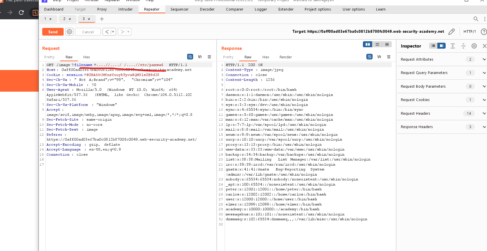

# Directory traversal

---

## Khái niệm

> Directory traversal (Truyền tài đường dẫn tệp): Là vul cho attacker tấn công và đọc các file tùy ý trên server đang sử dụng

> Có thể là code, data, thông tin xác thực và các file

> Một số trường hợp attacker có thể ghi vào các file tùy ý trên máy chủ, sửa đổi info và hành vi của app và cuối cùng là toàn quyền kiểm soát server

---

## Reading arbitrary files via directory traversal

> Xem ứng dụng hiển thi hình ảnh được bán qua URL sau:
>
> ```
> 
> ```

> `loadImage` URL nhận tham số là tên file và sẽ trả về file cụ thể.Bản thân các file ảnh sẽ được lưu trữ tại `/var/www/imags`.

> Trong trường hợp này thì `API` sẽ lấy từ:
>
> ```
> /var/www/images/image.png
> ```

> Nếu app không có bất kì biện pháp bảo vệ `directory traversal` thì attacker có thể tấn công theo URL sau:
>
> ```
> https://insecure-website.com/loadImage?filename=../../../etc/passwd
> ```

> Điều này sẽ khiến ứng dụng đọc:
>
> ```
> /var/www/images/../../../etc/passwd
> ```

### Lab: File path traversal, simple case

> Des: Lab này chứa vul `Directory traversal` tại images

> Để solve thì truy cập content của path : `/etc/passwd`

> Bài này chỉ cần đổi path tại path: `/image?filename=../../../etc/passwd`:
> 

---

## Common obstacles to exploiting file path traversal vulnerabilities

> Nhiều ứng dụng đặt input của user nhập vào đường dẫn tệp, điều đó thực hiện một số loại defen `directory traversal` nhưng nó vẫn có thể bị bypass

> Nếu ứng dụng tách hoặc chặn folder từ file tải lên do user cung cấp thì có thể pass qua bằng nhiều tech.

> Có thể sử dụng path tuyệt đối từ folder root của hệ thống chẳng hạn như `filename=/etc/passwd` để có thể tham chiếu đến trực tiếp mà không cần qua sử dụng bất kì sự truyền tải nào

### Lab: File path traversal, traversal sequences blocked with absolute path bypass

> Des: Lab này chứ vul `directory traversal`

> Lab chặn các trình tự truyền tải coi như filename được cung cấp có các liên quan đến folder làm việc mặc định.

> Để solve thì truy xuất content của `/etc/passwd`

> Bài này chỉ cần đổi `filename=/etc/passwd` > 

---

> Nếu các trình duyệt không nhận thì có thể thay đổi kí tự:
>
> ```
> .....// or ....\/
> ```

### Lab: File path traversal, traversal sequences stripped non-recursively

> Des:Lab này chứ vul `directory traversal`

> Ứng dụng tách các trình tự truyền tải đường dẫn khỏi tên tệp do người dùng cung cấp trước khi sử dụng.

> Để solve thì truy xuất content của `/etc/passwd`

> Bài này chỉ cần đổi `filename=....//....//....//etc/passwd` > 
