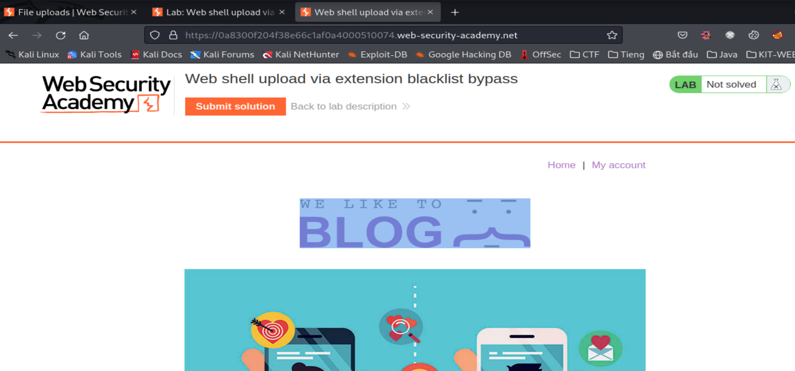

# Lỗ hổng File Upload

## Khái niệm

> File upload là khi web server cho phép user upload file mà lên hệ thống mà không có cơ chế xác minh đầy đủ ví dụ như filename, type, size, ...
>
> Ví dụ như một chức năng tải ảnh lên server mà không có xác minh đầy đủ hoặc xác minh sai thì các hacker có thể tải lên những tệp độc hại, nguy hiểm.
>
> Điều này có thể dẫn tới server có thể bị lỗi RCE.

## Tác hại

> Khi file đã được upload lên hệ thống (ví dụ như các file .php, .jsp, ...) được thực thi dưới dạng mã, hacker sẽ có chức năng như web shell, và có toàn quyền trên hệ
> thống.
>
> Nếu tệp không được xác thực đúng cách, trùng tên file trong hệ thống. Điều này có thể khiến các file trong hệ thống bị ghi đè.
>
> Không đảm bảo được size của file, điều này sẽ dẫn tới cuộc tấn công từ chối dịch vụ ví dụ như DoS (attacker sẽ lấp đầy dung lượng đĩa có sẵn).

## Các lỗ hổng:

## Exploiting unrestriced file uploads to deploy a web shell (Khai thác file upload không hạn chế để triển khai web shell)

> Tình huống xấu nhất có thể xảy ra là khi một trang web cho phép user tải các tệp script ví dụ như php, java, python . Điều này làm cho việc tạo web shell riêng trên
>
> web server trở nên dễ dàng.
>
> _web shell là một tập lệnh độc hại cho phép attacker có thể thực hiện các lệnh tùy ý trên máy chủ server từ xa_
>
> Nếu tải lên web shell thành công thì attacker có toàn quyền kiểm soát máy chủ. Đồng nghĩa với việc có thể đọc, ghi các file tùy ý...

```
<?php echo file_get_contents('/path/to/target/file'); ?>
```

#### Lab: Remote code execute via web shell upload

> Des: Lab này có chứa 1 chức năng để tải ảnh nên nhưng nó không filter bất kì tệp nào khi upload lên.
>
> Nhiệm vụ là tải 1 web shell php cơ bản và sử dụng nó để đọc nội dung của file `/home/carlos/secret`.
> Sau đó submit flag.
>
> Có thể đăng nhập bằng tài khoản `wiener:peter` để upload file.

**Giao diện ban đầu**


> Khi login bằng tài khoản được cấp là `wiener:peter` thì qua một giao diện khác có form để thay đổi ảnh
> 
>
> Đề bài yêu cầu lấy nội dung của path `/home/carlos/secret` viết script để exploit nó
>
> Giờ thử upload xem có bị filter gì không đã nhé!
>
> Đây là script mình dùng:

```
<?php echo file_get_contents('/home/carlos/secret'); ?>
```


Uploaded thành công -> chứng tỏ bài đầu nên nó không kiểm tra bất kì thứ gì của file.

Ta check ở trên Burp Suite thì thấy path này nó chứa đường dẫn của script mình upload lên:


Để lấy passwd thì có 2 cách:

_Cách 1:_

> Từ HTTP history của Burp Suite ta resend path `/files/avatars/exploit.php` qua repeater rồi send nó
> 

_Cách 2:_

> Copy path `/files/avatars/exploit.php` rồi gửi thẳng qua url của web
> 

**Ngoài ra còn có thể upload script như sau:**

```
<?php echo system($_GET['command']); ?>
```

> Script trên sử dụng khi ta có thể truyền tham số qua param của url:

```
GET /example/exploit.php?command=id HTTP/1.1
```

---

## Exploiting flawed validation of file uploads (Khai thác xác thực sai của file uploads)

### Flawed file type validation - Xác thực loại file không đúng:

> Khi gửi HTML forms, thì browser sẽ gửi data cùng với phương thức POST với `Content-Type:x-www-form-url-encoded`.
>
> Nó phù hợp với văn bản đơn giản
> như tên, địa chỉ... nhưng nó không phù hợp để gửi 1 lượng lớn dữ liệu nhị phân
> chẳng hạn như img, pdf, ... Trong case này thì content type đa phần là `multipart/form-data`.
>
> Một cách mà các trang web xác thực file upload là qua `Content-Type` xem nó có khớp với `MIME` type không.
>
> Ví dụ server chỉ nhận `image/jpeg`, ... đại loại là file img, để bypass qua thì ta có
> thể sử dụng tools như Burp Repeater.

#### Lab: Web shell upload via Content-Type restriction bypass (bypass qua Content-Type)

> Des: Lab này chứa một chức năng tải file img dễ bị attack
>
> Nó cố gắng ngăn chặn user tải loại file không mong muốn lên server
>
> Mục tiêu: Tải web shell php lên để exploit nội dung của path: `/home/carlos/secret`
>
> Có thể đăng nhập bằng tài khoản: `wiener:peter`

**Giao diện ban đầu**


> Giao diện ban đầu cũng như lab trên

> Bài này phải dùng Burp Suite để chặn request rồi đổi `Content-Type` thành `image/png` vì đề bài nó filter các file khác file image
> 

> Đã đổi:
> 

> Bú
> 

---

### Preventing file execution in user-accessible directories (Ngăn chặn việc thực thi tệp trong thư mục người dùng có thể truy cập)

> Ta nên chặn các tệp nguy hiểm ngay từ khi nó bắt đầu được up lên. Nhưng tuyến phòng thủ thứ 2 là ngăn máy chủ thực thi tệp.
>
> Để phòng thủ thì các máy chủ thường chỉ chạy các tệp có kiểu MIME mà chúng được cấu hình rõ ràng để thực thi. Nếu không thuộc loại MIME được cấu hình thì nó sẽ trả về lỗi.

```
GET /static/exploit.php?command=id HTTP/1.1
Host: normal-website.com


HTTP/1.1 200 OK
Content-Type: text/plain
Content-Length: 39

<?php echo system($_GET['command']); ?>
```

> Loại cấu hình này thường khác nhau giữa các thư mục. Thư mục mà các tệp người dùng tải lên có thể được kiểm soát chặt chẽ hơn so với các thư mục khác ngoài tầm với của người dùng
>
> Nếu có thể tải tệp lên một thư mục khác không được cho phép thì máy chủ có thể execute file của bạn

#### Lab: Web shell upload via path traversal(Upload web shell thông qua path traversal)

> Des: Web này chứa một lỗ hổng tải ảnh lên. Máy chủ được cấu hình để ngăn việc execute file do người dùng tải lên.
>
> Có thể exploit qua lỗ hổng directory traversal
>
> Mục tiêu là lấy được content của path `/home/carlos/secret`
>
> Đăng nhập bằng tài khoản: `wiener:peter` để upload file

**Giao diện ban đầu**


Cũng giống như các labs trên

Ta cũng login và upload file lên bình thường:

> Bài này thì nó lại không filter đầu vào, up file gì cũng được =)) nhưng không exploit được
> 

> Ta có thể thấy là file vẫn được upload lên path này nhưng không exploit được nó
> 

> Nó chỉ trả về dạng text:
> 

Thì bài này có liên quan tới directory traversal nên để exploit nó chắc phải tải nó lên 1 path khác, vì path mà user được tải file nên nó đang kiểm soát chặt chẽ

> Ta thử upload lên path khác ví dụ như: `../` (vào path parent của nó xem sao)
>
> Qua lại burp history rồi tìm path `/my-account/avatar` send to repeater
> 

> Đổi ở phần request header: `Content-Disposition: form-data, name="avatar", filename=../exploit.php` sau đó send nó:
> 

> File đã được upload nhưng không exploit được nó. Tại sao, vì url đã bị encoded kí tự `/` nó đã trở thành: `%2f`  

> Ta upload lại như sau:
> 

> exploit nó:
> 

---

### Insufficient blacklisting of dangerous file types(blacklist)

> Một trong những cách để ngăn việc người dùng tải lên những file độc hại thì là dùng blacklist
>
> Nhưng blacklist đôi khi vẫn thiếu sót các file để tải lên web shell
>
> Ví dụ 1 blacklist gồm các tệp như: `[.php, .js, .java]` còn những file ít được dùng tới như: `[.php5, .shtml, ...]` vẫn được các hacker dùng tới!

#### Overriding the server configuration(Ghi đè file config của server)

> Máy chủ sẽ không thực thi các tệp trừ khi chúng ta config nó thực thi.
>
> Ví dụ để máy chủ Apache thực thi các tệp PHP thì dev phải thêm cấu hình như sau:
>
> `/etc/apache2/apache2.conf`:
>
> ```
> LoadModule php_module /usr/lib/apache2/modules/libphp.so
> AddType application/x-httpd-php .php
> ```
>
> Nhiều máy chủ cũng cho phép dev config server từ bên trong các thư mục riêng để ghi đè hoặc thêm các tính năng
>
> Ví dụ: Apache server sẽ cấu hình riêng cho các thư mục từ file .htaccess nếu có.

#### Lab: Web shell upload via extension blacklist bypass (bypass blacklist)

> Des: Lab này chứa lỗi hổng upload ảnh. Một số extension file có trong blacklist.
>
> Mục tiêu: lấy được content của path `/home/carlost/secret`
>
> Đăng nhập tài khoản: `wiener:peter`

**Giao diện ban đầu**

> Cũng giống các labs trước:
> 

> Khi upload file php để exploit thì nó đã dính black list:
> 

> Dùng file .php5 tuy uploaded nhưng k exploit được
> 

> Vì server chặn file .php nên ta sẽ ánh xạ file .php sang file khác (Do tự nghĩ), ví dụ như .133t
> Để làm được thì sẽ phải cấu hình lại file `.htaccess` trên server:
> Sửa:
>
> ```
> AddType application/x-httpd-php .133t
> ```
>
> Ta dựa vào path `/my-account/avatar` với phương thức POST để sửa
>
> Qua Burp History tìm path trên rồi send to Repeater
>
> Sửa `Content-Type: text/plain`, `filename: .htaccess`, sửa payload của file `exploit.php` ban đầu thành `AddType application/x-httpd-php .133t` nó sẽ trông như này:
> 

> Sau đó ta tạo 1 file explout.133t rồi upload lên sẽ exploit được =)))
> 

---

### Obfuscating file extensions (Làm xáo trộn file extension)

> Ngay cả blacklist đầy đủ nhất cũng sẽ bị bỏ qua bởi các kỹ thuật obfuscating cổ điển.
>
> Giả sử xác thực có phân biệt chữ hoa chữ thường ví dụ như tệp `exploit.pHp` là 1 tệp `php`
>
> Nếu ánh xạ của MIME không phân biệt chữ hoa chữ thường thì b có thể exploit bằng cách này
>
> 1. Tệp như: `exploit.php.jpg`
> 2. Thêm dấu chấm: `exploit.php.`
> 3. Dùng URL Encoding (hoặc double URL Encoding) cho dấu chấm, gạch chéo lên, gạch chéo ngược: `exploit%2Ephp`
> 4. Dùng `Null Byte` tùy vào đc viết bằng các ngôn ngữ khác nhau để xử lý: `exploit.asp;.jpg`, `exploit.asp%00.jpg`
> 5. Sử dụng các ký tự unicode multibyte để chuyển đổi thành byte và normalization:
>    `xC0 x2E xAE or xC0 xAE`...

#### Lab: Web shell upload via obfuscated file extension

> Des: Lab này bị dính lỗi file upload, dùng tech xáo trộn cổ điển để exploit nó.
>
> Mục tiêu: lấy content của path `/home/carlos/secret`
>
> Đăng nhập tài khoản: `wiener:peter`

**Giao diên ban đầu**


> Lab này chỉ nhận file img:
> 

> Test:
> Đổi file dạng kiểu `img.php.jpg` tuy up được nhưng không exploit được
> 

> Ta thử dùng Null Byte:
> `img.php%00.jpg` > 

---

#### Flawed validation of the file's contents (Xác thực sai nội dung tệp)

> Thay vì tin tưởng hoàn toàn vào `Content-Type` tại request.
>
> Server sẽ an toàn hơn khi xác minh đúng content của tệp có đúng như gì mong đợi
>
> In case web có function tải ảnh lên, máy chủ sẽ cố gắng xác định những thuộc tính nhất định như size, ...
>
> Nếu upload file `php` thì nó sẽ không ứng với bất kì thuộc tính nào. Do đó server sẽ từ chối
>
> Tương tự cùng với 1 số loại tệp luôn chứa một số byte cụ thể ở đầu hoặc cuối
>
> Nó có thể đc sử dụng để xác thực một số tệp
>
> Ví dụ `JPG` luôn có byte là `FF D8 FF`
>
> Sử dụng tools như `ExifTool` để tạo ra 1 tệp `JPEG` chứa mã độc trong metadata

#### Lab: Remote code execution via polyglot web shell upload

> Des: Lab này chứa vul file upload. Mặc dù server có xác thực nhưng vẫn bị lỗi execute server-side
>
> Mục tiêu lấy content của path `/home/carlos/secret`
>
> Đăng nhập tài khoản `wiener:peter` để exploit

**Giao diện ban đầu**


> Upload các file như `.php, .php%00.jpg, .htaccess` đều error
> 

> Dùng tools ExifTool để tạo file php chứa metadata:
>  > 

> Done:
> 

---

#### Exploiting file upload race conditions (Exploit các điều kiện tải lên)

> Giờ các framework ngày càng phát triển nên đã phần nào chống lại được các cuộc attack này
>
> Các dev đôi khi thực hiện quá trình xử lí file upload của họ 1 cách độc lập với bất kỳ khuôn khổ nào
>
> Điều này khổ chỉ phức tạp, nó còn đưa ra các điều kiện để race conditions cho phép attacker bypass ngay cả những validation mạnh mẽ nhất

> Ví dụ:
> Một web file upload trực tiếp trên hệ thống chính và xóa file đó 1 lần nếu tệp không vượt qua validation
>
> Quá trình này chỉ mất vài mili giấy, nhưng với thời gian ngắn như thế thì tệp đã tồn tại trên server và attacker vẫn có thể execute nó
>
> Vul này cực kì tinh vi, khiến chúng khó bị phát hiện trong quá trình kiểm tra trừ khi có thể tìm thấy cách rò rỉ mã nguồn liên quan

#### Lab: Web shell upload via race condition ()

> Level: Expert
>
> Des: Lab này chứ vul upload file img. Mặc dù nó có validation mạnh mẽ, những vẫn có thể bypass bằng cách khai thác race condition
>
> Mục tiêu: Lấy content của path `/home/carlos/secret`
>
> Đăng nhập tài khoản `wiener:peter`

**Giao diện ban đầu**


> Bài này sử dụng `Turbo Intruder` để exploit nó:
>
> Đầu tiên thì install nó:
> 

> Gửi file `.php` thì nó bị lỗi, nên giờ gửi file `.php.jpg` để send qua `Turbo Intruder` > 

> 

> Copy phần `POST, GET` để cho vào payload của `Turbo Intruder` (Copy hết phần request http)
> 

> Đoạn này là file `exploit.php` nhé, kh phải `exploitt.php` đou!
> 

> Attack

> DONE:
> 

---

## Cách ngăn chặn

> - Kiểm tra `file extension` với `whitelist` gồm các thành phần mở rộng thay vì `blacklist` cho các extension bị cấm
>
> - Đảm bảo `filename` không contain chuỗi con như `../`
>
> - Đổi tên tệp tránh bị ghi đè file
>
> - Không tải tệp lên hệ thống vĩnh viễn cho đến khi đã validate
