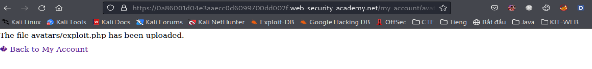
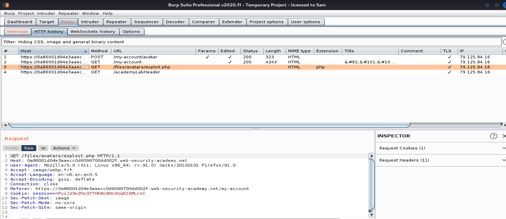
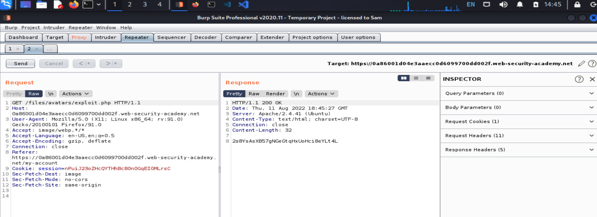
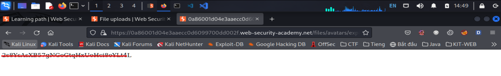

# Lỗ hổng File Upload

## Khái niệm

> File upload là khi web server cho phép user upload file mà lên hệ thống mà không có cơ chế xác minh đầy đủ ví dụ như filename, type, size, ...
> Ví dụ như một chức năng tải ảnh lên server mà không có xác minh đầy đủ hoặc xác minh sai thì các hacker có thể tải lên những tệp độc hại, nguy hiểm.
> Điều này có thể dẫn tới server có thể bị lỗi RCE.

## Tác hại

> Khi file đã được upload lên hệ thống (ví dụ như các file .php, .jsp, ...) được thực thi dưới dạng mã, hacker sẽ có chức năng như web shell, và có toàn quyền trên hệ
> thống.
> Nếu tệp không được xác thực đúng cách, trùng tên file trong hệ thống. Điều này có thể khiến các file trong hệ thống bị ghi đè.
> Không đảm bảo được size của file, điều này sẽ dẫn tới cuộc tấn công từ chối dịch vụ ví dụ như DoS (attacker sẽ lấp đầy dung lượng đĩa có sẵn).

## Các lỗ hổng:

### Exploiting unrestriced file uploads to deploy a web shell (Khai thác file upload không hạn chế để triển khai web shell)

> Tình huống xấu nhất có thể xảy ra là khi một trang web cho phép user tải các tệp script ví dụ như php, java, python . Điều này làm cho việc tạo web shell riêng trên
> web server trở nên dễ dàng.
> _web shell là một tập lệnh độc hại cho phép attacker có thể thực hiện các lệnh tùy ý trên máy chủ server từ xa_
> Nếu tải lên web shell thành công thì attacker có toàn quyền kiểm soát máy chủ. Đồng nghĩa với việc có thể đọc, ghi các file tùy ý...

```
<?php echo file_get_contents('/path/to/target/file'); ?>
```

## Lab: Remote code execute via web shell upload

> Des: Lab này có chứa 1 chức năng để tải ảnh nên nhưng nó không filter bất kì tệp nào khi upload lên.
> Nhiệm vụ là tải 1 web shell php cơ bản và sử dụng nó để đọc nội dung của file `/home/carlos/secret`. Sau đó submit flag.
> Có thể đăng nhập bằng tài khoản wiener:peter để upload file.

**Giao diện ban đầu**

Khi login bằng tài khoản được cấp là `wiener:peter` thì qua một giao diện khác có form để thay đổi ảnh

Đề bài yêu cầu lấy nội dung của path `/home/carlos/secret` viết script để exploit nó
Giờ thử upload xem có bị filter gì không đã nhé!
Đây là script mình dùng:

```
<?php echo file_get_contents('/home/carlos/secret'); ?>
```


Uploaded thành công -> chứng tỏ bài đầu nên nó không kiểm tra bất kì thứ gì của file.
Ta check ở trên Burp Suite thì thấy path này nó chứa đường dẫn của script mình upload lên:


Để lấy passwd thì có 2 cách:

_Cách 1:_

Từ HTTP history của Burp Suite ta resend path `/files/avatars/exploit.php` qua repeater rồi send nó


_Cách 2:_

Copy path `/files/avatars/exploit.php` rồi gửi thẳng qua url của web

