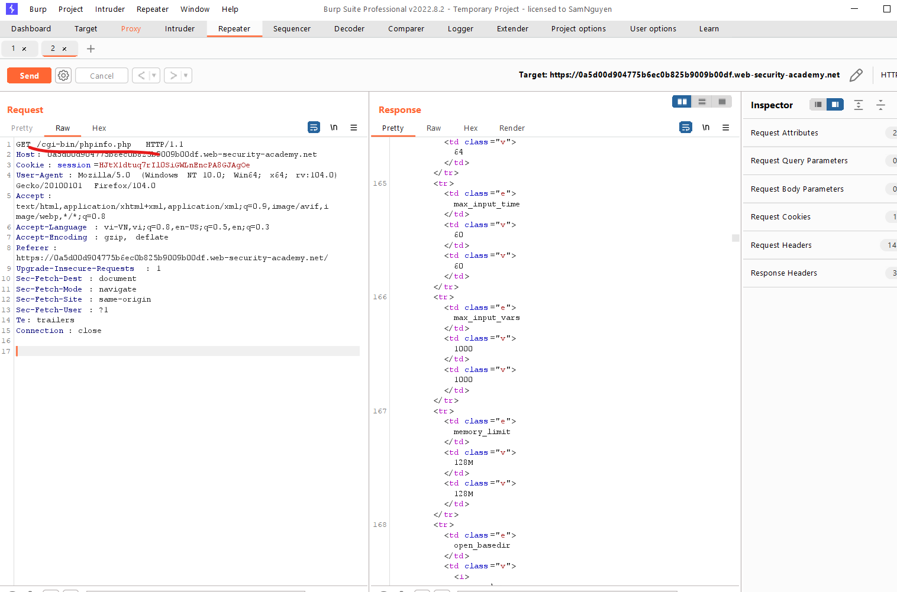

# Information disclosure vulnerabilities

## Khái niệm

> Information disclosure, hay được gọi là rò rỉ thông tin là khi web vô tình để lộ thông tin nhạy cảm cho người dùng.
>
> - Dữ liệu về ng dùng khác
> - Dữ liệu thông tin kinh doanh, thương mại
> - Chi tiết về trang web, cơ sở hạ tầng

## Ví dụ về infomation desclosure

> - Tiết lộ các hidden folder, constructure, content thông qua `robots.txt`
> - Cung cập access vào source code thông qua các bản backups tạm thời
> - Đề cập rõ ràng về bảng db, cột trong thông báo errors
> - Khóa API, IP, infor đăng nhập CSDL trong source code

## Tìm và khai thác lỗ hổng

> Một số kỹ thuật, tools để xác định `information disclosure`

### How to test for information disclosure vulnerabilities (Kiểm tra lỗ hổng)

> Một số kỹ thuật và tools cao cấp mà có thể sử dụng để xác định vul:
>
> - Fuzzing
> - Burp scanner
> - Burp engagement tool
> - Engineering information responses

#### Fuzzing

> Nếu xác định đượck param. có thể sử dụng các data type không mong muốn vào các `fuzz strings` được chế tạo đặc biệt để xem có tác dụng gì.
>
> Sử dụng automate bằng các công cụ như `Burp Intruder`:
>
> - `add payload` vào các param và sử dụng các wordlist để kiểm tra các input khác nhau liên tiếp
> - Dễ dàng xác định sự diff bằng các xem `HTTP status code, response time, length`
> - Sử dụng grep matching rules để nhanh chóng xác định các lần xuất hiện của keyword, ví dụ như: `error, invalid, SELECT, ....`
> - Áp dụng các quy tắc grep và so sánh content của các item trong các response

> Cũng có thể dùng extension `Logger++`. Ngoài việc ghi lại log request và responses từ tất cả các tool của burp, nó cho phép xác định các filter nâng cao để làm nổi bật các mục

#### Using Burp Scanner

> Cung cấp tính năng quét trực tiếp để kiểm tra các mục
>
> Ví dụ: Sẽ cảnh báo nếu nó tìm thấy các info nhạy cảm như email credit, .... trong responses

#### Using Burp's engagement tools

#### Common sources of information disclosure

#### Files for web crawlers

> Nhiều web cung cấp file /robots.txt và /sitemap.xml để giúp tiến trình thu thập thông tin điều hướng trang web của họ

#### Directory listings

#### Developer comments

#### Error messages

#### Lab: Information disclosure in error messages

> Thông báo lỗi error message reveal tiết lộ ver của third-party framework. Lấy ver của nó rồi submit

>  

---

#### Debugging data

> Với mục đích vá lỗi, nhiều web tạo ra các custom error message chứa log về hành vi ứng dụng:
>
> - Là các biến chính có thể thao tác từ user
> - thông tin đăng nhập máy chủ backend
> - tệp, thư mục máy chủ
> - key được sử dụng để mã hóa dữ liệu truyền qua máy khách

#### Information disclosure on debug page

> Des: Lab này chứa trang để debug để lộ thông tin nhạy cảm của ứng dụng. Để solve lấy và submit `SECRET_KEY`

> Bài này chỉ cần view source code và đọc comment của dev và gửi request tới URL được ghi là oke.
>
> Có thể dùng tool `Find comment` của `burp suite` để tìm các comment của dev để lại:
>     

---

#### User account pages

> Hồ sơ hoặc tài khoản của user thường chứa các thông tin nhạy cảm như địa chỉ, sdt, api, ...
>
> User chỉ có thể vào tài khoản riêng của họ, điều này không thể hiện là 1 vul. Tuy nhiên một số web bị lỗ hổng logic. Cho phép attacker xem được data của các user khác ví dụ như:
>
> ```
> GET /user/personal-info?user=carlos
> ```

> Hầu hết các trang web sẽ chặn bước này

#### Source code disclosure via backup files

> Có được quyền truy cập source code giúp attacker hiểu được hành vi của ứng dụng và xây dựng các cuộc attack với mức độ nghiêm trọng hơn.
>
> Ví dụ như khóa API và thông tin đăng nhập backend: Điều này giúp xác định được công nghệ đang sử dụng
>
> Thêm dấu `~` vào

#### Lab: Source code disclosure via backup files

> Lab này làm rò rỉ source code thông qua các file backup. Gửi passwd db để solve

> Chỉ cần vào file `robots.txt` rồi làm theo là solve
>   

> Một khi attacker có quyền access source code, đây là bước lớn có thể xác định và khai thác. 1 Ví dụ về `deserialization`, xem vul sau 1 chủ đề chuyên dụng (advanced topic)

---

#### Information disclosure due to insecure configuration

> Nhiều web bị attack do config không đúng. Điều này trở nên rộng rãi khi sử dụng phần mềm thứ 3 mà một loạt tùy chọn cấu hình không nhất thiết phải được những người implement phải hiểu rõ
>
> Trong các case khác, dev có thể quên tắt tùy chọn gỡ lỗi trong môi trường sản xuất. Ví dụ HTTP TRACE method được thiết kế cho chẩn đoán, nếu được bật, máy chủ web sẽ phản hồi TRACE method bằng các repeat các response

#### Lab: Authentication bypass via information disclosure

> Des:Lab có vul bỏ qua authen, nhưng khi exploit mà không có kiến thức về HTTP là không thực tế. Để solve xóa tài khoản `carlos`. Đăng nhập bằng `wiener:peter`

> Ban đầu dùng get để vào path `/admin` thì unauthen:
>  

> Chuyển sang `TRACE`:
> 

> Nó sẽ lấy IP của máy để cho vào `X-Custom-IP-Authorization:`, phải đổi thành localhost nên thêm `127.0.0.1` >   

---

#### Version control history

> Tất cả các trang web đều được sử dụng và phát triển bằng 1 hệ thống chẳng hạn như `git`. Theo mặc định, một dự án đều được lưu trữ trong file `.git` . Trong case này chỉ cần truy cập tới file này là được
>
> Tải file này về đôi khi có những thứ thú vị trong nó

#### Lab: Information disclosure in version control history

> Des: Chứa data nhạy cảm. Lấy passwd của administrator và xóa carlos

> Ban đầu clone repo đó về máy:
>  

> Dùng các command như `git log, git status`:
>  

> Thấy 2 commit khác nhau, so sánh nó dùng `git diff cmd1 cmd2`:
>  
