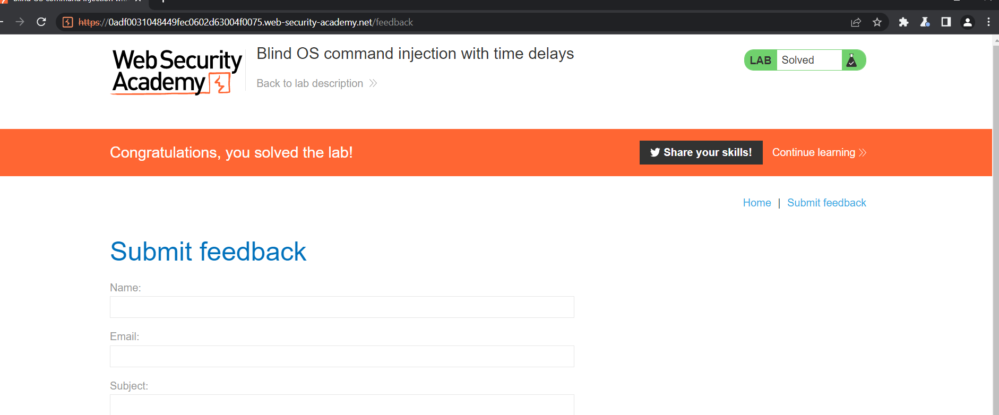

# OS command injection

## Khái niệm

> 

## OS command injection là gì?

> OS command injection (hay còn được gọi là shell injection) là 1 vul web cho phép attacker thực thi command trên OS (HĐH) tùy ý trên server và xâm phạm, lấy cắp data.

> Thông thường attacker có thể lợi dụng vul để xâm phạm các thành phần khác, khai thác các mối quan hệ

## Executing arbitrary commands

> Xem xét ứng dụng shopping sau để xem mặt hàng có còn trog shop hay không:
>
> ```
> https://insecure-website.com/stockStatus?productID=381&storeID=29
> ```

> Để cung cấp thông tin mặt hàng, app phải query các system kế thừa nhau. Các chức năng có thể gọi bằng shell:
>
> ```
> stockreport.pl 381 29
> ```

> Vì app không triển khai các biện pháp bảo vệ nên có thể đưa shell vào OS:
>
> ```
> & echo aiwefwlguh &
> ```

> Nó sẽ execute:
>
> ```
> stockreport.pl & echo aiwefwlguh & 29
> ```

> `echo` chỉ là lệnh in cơ bản, đây là cách hữu ích để thử exploit. `&` để phân tách chuỗi trong shell. Kết quả:
>
> ```
> Error - productID was not provided
> aiwefwlguh
> 29: command not found
> ```

> 3 Dòng đầu chứng minh rằng:
>
> `stockreport.pl` không được thực thi là do thiếu đối số
>
> `echo` vẫn được execute
>
> `29` nó là không phải command

### Lab: OS command injection, simple case

> Des: Lab này chứa vul OS command injection trong check sản phẩm. Ứng dụng thực thi một lệnh shell với id của sản phẩm. Để solve hãy thực hiện lệnh `whoami` tại người dùng hiện tại

> Bài này chỉ cần vào check stock rổi thay đổi param thêm `|whoami` là oke:
> 

## Useful commands

> Khi đã exploit được vul thì dưới đây là một số lệnh hữu ích trên nền tảng linux và window:
>
> Purpose of command | Linux | Windows
>
> Name of current user | whoami | whoami
>
> Operating system | uname -a | ver
>
> Network configuration| ifconfig | ipconfig /all
>
> Network connections | netstat -an | netstat -an
>
> Running processes | ps -ef | tasklist

## Blind OS command injection vulnerabilities (Lỗ hổng chèn lệnh hệ điều hành mù)

> Ứng dụng không trả về kết quả trong response, nhưng vẫn có thể exploit bằng chèn mù nhưng cần các kĩ thuật khác nhau

> Xem xét 1 web cho user gửi feedback về web. User gửi phản hồi và email của họ. Sau đó phía server tạo mail và gửi về admin web:
>
> ```
> mail -s "This site is great" -aFrom:peter@normal-user.net feedback@vulnerable-website.com
> ```

## Detecting blind OS command injection using time delays (Phát hiện đưa lệnh mù vào hệ điều hành bằng cách sử dụng độ trễ thời gian)

> Có thể inject lệnh đưa vào sẽ kích hoạt time delays. Lệnh `ping` là 1 cách hiệu quả để thực hiện việc này vì nó cho phép chỉ định số lượng ICMP cần gửi do đó thời gian cần thiết để chạy lệnh:
>
> ```
> & ping -c 10 127.0.0.1 &
> ```

> Lệnh này sẽ khiến ứng dụng ping bộ điều hợp mạng loopback trong 10 giây.

### Lab: Blind OS command injection with time delays

> Des: Chứa vul blind OS command inject tại submit feedback. Chứa thực thi shell, output không được response. Để solve hãy exploit blind os command injection gây là delays 10s

> Dùng burp và chặn sửa request tại param email: `email:x||ping+-c+10+127.0.0.1||` > 

> Đợi 10s sau burp sẽ response và qua web sẽ solve được:
> 
