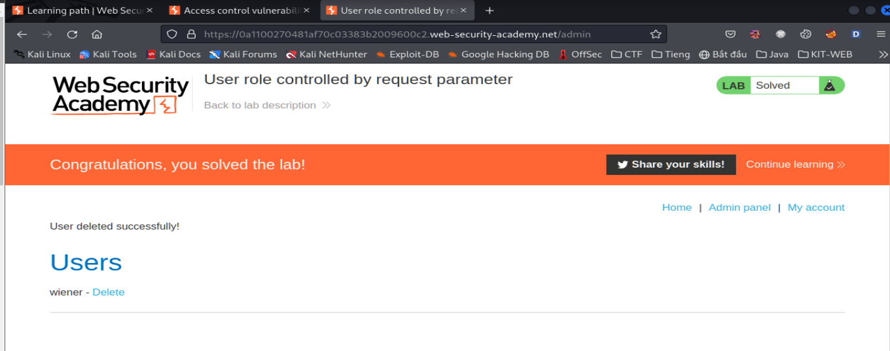
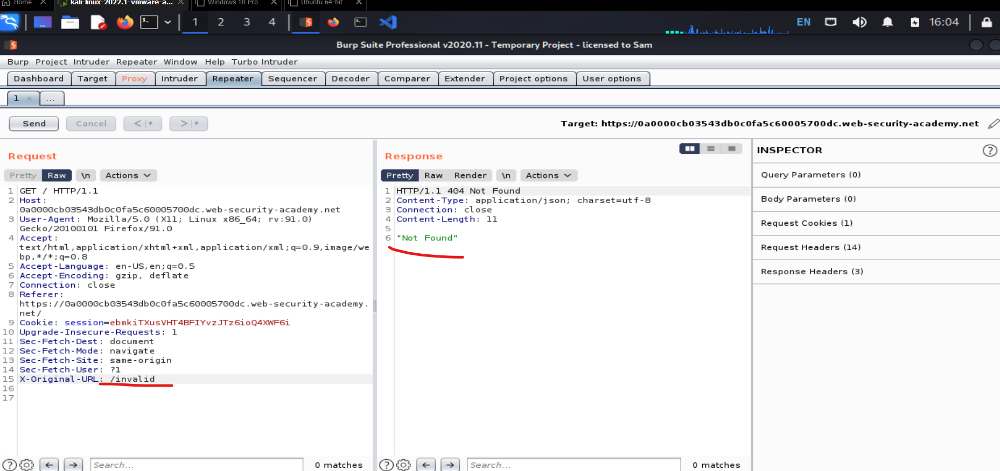
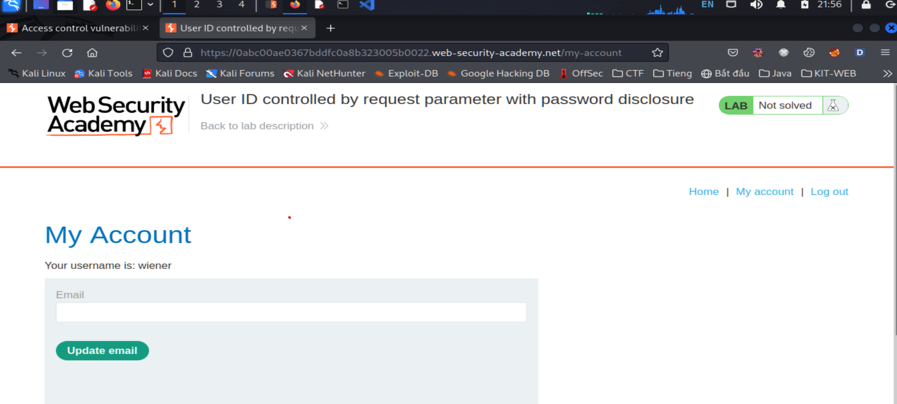
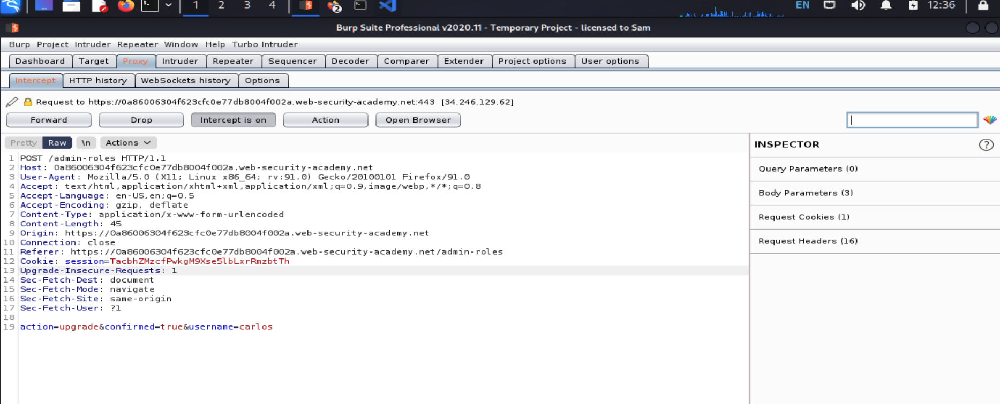

# Access control (Kiểm soát truy cập & leo thang đặc quyền)

## Kiểm soát truy cập là gì? (Access control)

> `Access Control` (authenrization) là việc áp dụng ràng buộc với ai hoặc cái gì có thể thực hiện các hành động cố gắng hoặc truy xuất tài nguyên.
>
> - `Autherization` người dùng và confirm chính là họ
> - `Session management` xác định các yêu cầu `HTTP` nào đang được thực hiện
> - `Access control` xác định người dùng xem có được quyền truy cập

> `Broken access control` là 1 vul thường gặp và nghiêm trọng. Thiết kế và quản lí `access control` là 1 vấn đề phức tạp

> Từ góc độ người dùng `access control` được chia thành:
>
> - Kiểm soát truy cập dọc (Vertical access control)
> - Kiểm soát truy cập ngang (Horizontal access control)
> - Kiểm soát truy cập phụ thuộc vào ngữ cảnh (Context-depement access control)

### Vertical access controls

> Là cơ chế hạn chế truy cập vào function sensitive không có sẵn cho người dùng.
>
> Với `Vertical access control`, user khác nhau có quyền truy cập vào các function ứng dụng khác nhau
>
> Ví dụ: qtv có thể sửa, xóa bất kì tài khoản của user nào, trong khi user bình thường không có các chức năng này

### Horizontal access controls

> Là cơ chế hạn chế truy cập vào tài nguyên đối với user được phép truy cập vào tài nguyên đó
>
> User khác nhau được phép truy cập vào tập hợp con các tài nguyên cùng loại
>
> Ví dụ:

### Context-dependent access controls

> Hạn chế quyền truy cập vào function, tài nguyên dựa trên trạng thái của ứng dụng hoặc tương tác của user với nó
>
> Ngăn chặn người dùng thực hiện hành động không đúng thứ tự
>
> Ví dụ:
> web bán lẻ ngăn người dùng sửa đổi nội dung trong giỏ hàng sau khi họ đã thanh toán

## Examples of broken access controls

### Vertical privilege escalation

> Nếu người dùng có thể truy cập vào các chức năng không được phép, đó là sự leo thang độc quyền

#### Unprotected functionality

> Cơ bản, sự leo thang độc quyền theo chiều dọc phát sinh khi ứng dụng không thực thi bất kì biện pháp bảo vệ nào đối với các chức năng nhạy cảm
>
> Ví dụ: Chức năng quản trị viên được liên kết từ trang chào mừng của quản trị viên nhưng không được liên kết với trang của user. User có thể vào thẳng path `/admin`:
>
> ```
> https://insecure-website.com/admin
> ```

#### Lab: Unprotected admin functionality

> Des: Lab chứa `admin panel` nhưng không được bảo vệ, xóa người dùng `carlos`

> Vào path với file `robots.txt`:
> 

> Làm theo nó:
>  

---

> Một số trường hợp, chức năng nhạy cảm không được bảo vệ mạnh mẽ mà được che dấu bằng cách cung cấp cho nó 1 URL ít được dự đoán.
>
> Ví dụ:
>
> ```
> https://insecure-website.com/administrator-panel-yb556
> ```

> Attacker không thể đoán được trực tiếp điều này. Tuy nhiên ứng dụng vẫn có thể làm rò rỉ URL cho user.
>
> Ví dụ có thể tiết lộ tỏng JS tạo giao diện người dùng dựa trên vai trò của người dùng

> ```
> <script>
> var isAdmin = false;
> if (isAdmin) {
> 	...
> 	var adminPanelTag = document.createElement('a');
> 	adminPanelTag.setAttribute('https://insecure-website.com/administrator-panel-yb556');
> 	adminPanelTag.innerText = 'Admin panel';
> 	...
> }
> </script>
> ```

> Tệp lệnh này thêm liên kết giao diện người dùng nếu họ là admin. Tuy nhiên tập lệnh chứa URL hiển thị tất cả người dùng bất kể vai trò của họ

#### Lab: Unprotected admin functionality with unpredictable URL

> Des: `admin panel` không được bảo vệ. Nó nằm ở vị trí không thể đoán nhưng vị trí được tiết lộ ở đâu đó trong app. Xóa carlos

> path được dấu tại trang chủ, `view source` là thấy `script`:
>   

---

#### Parameter-based access control methods

> Một số ứng dụng xác định ủy quyền truy cập hoặc vai trò của user khi login, sau đó lưu trữ thông tin này ở vị trí user có thể kiểm soát.
>
> Chẳng hạn như hidden field, cookie, tham số
>
> Ví dụ:
>
> ```
> https://insecure-website.com/login/home.jsp?admin=true
> https://insecure-website.com/login/home.jsp?role=1
> ```

> Như này là k an toàn, có thể sửa giá trị

#### Lab: User role controlled by request parameter

> Des: Chứa admin panel `/admin`. Bảng này xác định admin sử dụng cookie. Xóa carlos
>
> Dùng tài khoản: `wiener:peter`

> Đăng nhập tài khoản đã cho rồi chỉnh sửa cookie -> true:
>  

---

#### Lab: User role can be modified in user profile

> Des: Chứa admin panel `/admin`. Sửa vai trò với user là 2.
>
> Đăng nhập với tài khoản `wiener:peter`

> Dùng tài khoản đã cho vào thay đổi email:
> 

> `roleid`=1 thì không thấy gì, đổi sang 2 thì về lại web thì solve được
>  

---

#### Broken access control resulting from platform misconfiguration

> Một số ứng dụng thực thi các `access control` ở platform bằng cách hạn chế quyền truy cập vào URL và `HTTP methods` dựa trên vai trò của người dùng
>
> Ví dụ:
>
> ```
> DENY: POST, /admin/deleteUser, managers
> ```

> Quy tắc này sẽ từ chối quyền truy cập vào `POST method` trên UR `/admin/deleteUser` đối với người dùng trong nhóm `manager`
>
> Nhiều thứ có thể bị trục trặc nên có thể bypass qua:

> Một số framework hỗ trợ nhiều `HTTP header` khác nhau, có thể sử dụng để ghi đè URL trong 1 request
>
> Ví dụ như `X-Original-URL` và `X-Rewriter-URL`
>
> ```
> POST / HTTP/1.1
> X-Original-URL: /admin/deleteUser
> ...
> ```

#### Lab: URL-based access control can be circumvented

> Des: Web có `admin panel` chưa được xác thực tại `/admin` nhưng người dùng đã bị chặn ở bên ngoài. Tuy nhiên, backend hỗ trợ `X-Original-URL`

> 

> Thêm `X-Original-URL: /invalid` :
> 

> Đổi sang `/admin`:
>  

> Xóa:  

---

> Cuộc tấn công có thể phát sinh liên quan đến phương thức HTTP được sử dụng trong request
>
> Bên frontend hạn chế quyền truy cập dựa trên URL và HTTP method
>
> Nếu attacker có thể sử dụng phương thức GET (hoặc các phương thức khác) để thực hiện các hành động trên URL bị hạn chế.

#### Lab: Method-based access control can be circumvented

> Des: Lab này triển khai `access control` 1 phần trên HTTP methods của request. Đăng nhập admin với tài khoản `adminnistrator:admin`. Để solve đăng nhập với tài khoản `wiener:peter` rồi leo thang đặc quyền lên admin

**Giao diện ban đầu**


> Đăng nhập và vào với quyền admin:
> 

> Vào adminpanel chặn bắt hành vi update quyền rồi gửi sang repeater:
> 

> Dùng fire fox private để login với tài khoản user:
> 

> Copy cookie của user rồi chuyển qua repeater của admin thay cookie và user:
> 

> Chuyến sang POSTX method:
> 

> Dùng GET, sửa thành GEt sẽ k được, phải dùng `change request method`:
>  

### Horizontal privilege escalation

> Thông thường, cuộc tấn công leo thang đặc quyền theo chiều ngang có thể chuyển thành cuộc tấn công leo thang độc quyền theo chiều dọc. Làm ảnh hưởng đến người dùng có đặc quyền cao hơn
>
> Ví du: Leo thang đặc quyền ngang có thể cho phép kẻ tấn công đặt lại hoặc lấy passwd của user khác
>
> Ví dụ: attacker có thể truy cập vào tài khoản khác bằng kỹ thuật giả mạo tham số:
>
> ```
> https://insecure-website.com/myaccount?id=123
> ```

#### Lab: User ID controlled by request parameter

> Des: Lab chứa lỗi hổng leo thang đặc quyền chiều ngang trên tài khoản người dùng. Solve thì lấy khóa API của carlos rồi submit. Dùng tài khoản `wiener:peter` để login

**Giao diện**


> Đăng nhập với tài khoản được cấp rồi vào `My Account` chặn request:
> 

> Sửa thành `carlos` rồi submit flag:
>  

---

> Trong một số ứng dụng, tham số có thể exploit không có giá trị dự đoán được.
>
> Ví dụ: thay vì 1 số tăng dần, ứng dụng có thể sử dụng số nhận dạng duy nhất trên toàn cầu (GUIDs) để xác định user. Ở đây attcaker có thể không đoán được, tuy nhiên GUID của user khác có thể được tiết lộ ở nơi khác trên ứng dụng mà user tham chiếu tới. Ví dụ như tin nhắn hoặc review của user

#### Lab: User ID controlled by request parameter, with unpredictable user IDs

> Des: Lab chứa lỗ hổng leo thang đặc quyền chiều ngang trên tài khoản người dùng, nhưng xác định người dùng bằng GUID. Để solve, tìm GUID của carlos sau đó gửi khóa API. Lấy tài khoản `wiener:peter` để login

**Giao diện**

> Với quả id kia thì chịu
> 

> Tìm post của user carlos:
> 

> Bắt request để lấy GUID:
> 

> Qua `My Account` của wiener rồi đổi thôi:
>  

---

> Một số trường hợp, ứng dụng không phát hiện user nào không được phép tủy cập tài nguyên và trả về chuyển hướng đến trang login. Tuy nhiên, phản hồi chứa chuyển hướng vẫn có thể bao gồm 1 số dữ liệu nhạy cảm của user

#### Lab: User ID controlled by request parameter with data leakage in redirect

> Des: Lab chứa lỗ hổng access control chứa thông tin nhạy cảm bị rò rỉ trong redirect. Để solve lấy khóa API của carlos rồi submit. Dùng tài khoản `wiener:peter` để login

> Bài này đăng nhập với user được cấp rồi vào `my account` chặn rồi đổi id thành carlos là xong:
>  

---

### Horizontal to vertical privilege escalation

> Thông thường một cuộc attacker leo thang đặc quyền theo chiều ngang có thể chuyển thành tấn công theo chiều dọc bằng cách làm ảnh hưởng tới người dùng có đặc quyền cao hơn
>
> Ví dụ: Leo thang đặc quyền chiều ngang có thể cho phép attacker đặt hoặc lấy passwd của người dùng khác. Nếu attacker nhắm tới admin và xâm phạm thì attacker có quyền quản trị và thực hiện leo thang đặc quyền theo chiều dọc

> Ví dụ:
> Attacker có thể quyền truy cập vào tk người dùng khác bằng cách sử dụng kỹ thuật giả mạo tham số cho việc leo thang đặc quyền theo chiều ngang
>
> ```
> https://insecure-website.com/myaccount?id=456
> ```

> Nếu mục tiêu là admin, attacker có thể truy cập và có quyền quản trị. Trang có thể tiết lộ passwd của admin và cung cấp phương tiện thay đổi hoặc có quyền cung cấp truy cập trực tiếp vào chức năng đặc quyền

#### Lab: User ID controlled by request parameter with password disclosure

> Des: Lab chứa trang tài khoản chứa mật khẩu người dùng hiện tại của người dùng hiện tại. Để solve hãy truy xuất tài khoản của admin sau đó xóa tài khoản carlos. Dùng tài khoản `wiener:peter` để login

> Login với tài khoản được cho:
> 

> Check path `My Account`:
> 

> Có thể giả mạo param -> administrator:
>  

> -> có passwd
>  

---

### Insecure direct object references (IDOR)?

> `IDOR` là 1 loại vul access control phát sinh khi ứng dụng sử dụng input cho user cung cấp để truy cập trực tiếp vào các object
>
> `IDOR` đã được phổ biến khi nó xuất hiện trong top 10 OWASP 2007

> `IDOR` ví dụ:
>
> Có nhiều ví dụ về IDOR do người dùng kiểm soát sử dụng để truy cập trực tiếp vào tài nguyên or chức năng

#### IDOR vulnerability with direct reference to database objects (IDOR với tham chiếu trực tiếp đến các obj CSDL)

> Xem xét URL sau:
>
> ```
> https://insecure-website.com/customer_account?customer_number=132355
> ```

> Ở đây khách hàng được sử dụng `cusstomer_account` làm bản ghi để truy vấn được thực hiện trên CSDL phía sau.
>
> Nếu không có biện pháp kiểm soát, attacker có thể chỉ cần sửa đổi giá trị `cusomers_numbers`

#### IDOR vulnerability with direct reference to static files (IDOR với tham chiếu trực tiếp tới file)

> IDOR phát sinh khi các tài nguyên nhạy cảm nằm trong các static file trên system. Ví dụ 1 trang web lưu các bản tin nhắn trò truyện vào bằng đĩa sử dụng tên tệp tăng dần, cho phép người dùng truy xuất nó
>
> ```
> https://insecure-website.com/static/12144.txt
> ```

> Tình huốn này, attacker có thể chỉ cần sửa đổi tên tệp để truy xuất bản ghi cho người dùng khác tạo.

#### Lab: Insecure direct object references

> Des: Lab lưu trữ nhật ký trò truyện của người dùng trực tiếp trên hệ thống tên, truy xuất bằng URL. Solve tìm passwd của carlos và đăng nhập vào tk

> Khi vào lab, ta click vào live chat, roi click vao `view tramscrip` để down file chat về. Sửa nó thành `1.txt`. Ban đầu minh không biết đâu. Thử đi thử lại thì lúc start lab thì nó chi cho down file `2.txt` > đoo len:
>   

### Access control vulnerabilities in multi-step processes ()

> Nhiều trang web thực hiện các chức năng quan trọng qua 1 loạt các bước. Vd chức năng cập nhập chi tiết user:
>
> - Load biểu mẫu thông tin chi tiết cho user cụ thể
> - Submit changes
> - Xác nhận

> Đôi khi 1 số trang web thực hiện các bưoc kiểm soát nghiêm ngặt, nhưng lại bor qua 1 soó bưocs
>
> Ví duj: giả sử các điều khiển truy cập được áp dụng chính xác cho bước đầu tiên và bước thứ hai, nhưng không áp dụng cho bước thứ ba. Tại đây, kẻ tấn công có thể truy cập trái phép vào chức năng bằng cách bỏ qua hai bước đầu tiên và trực tiếp gửi yêu cầu cho bước thứ ba với các tham số bắt buộc.

#### Lab: Multi-step process with no access control on one step

> Des: Chứa admin control panel cho admin với các bước thiếu sot khi thay doi vai trong nguoi dung
>
> Dang nhap bang admin de thu, solve thi dang nhap bang wiener:peter va khi thac de thanh quan tri vien

> Login với browser private với tài khoản wiener, login tài khoản administrator với browser thường.
>
> Vào control pane với administrator, nâng cấp với tài khoản carlos rồi chặn bắt nó. Vì nó cần các bước để xác nhận thông tin:

>  

> Vì nó cần các xác thực như trên
>  

> Bắt cookie
> 

> Đổi nó:
> 

---

### Referer-based access control

> Một số trang web kiểm soát người dùng bằng `referer` header trong `http method`. `referer header` phải được thêm vào request
>
> Ví dụ:Ứng dụng kiểm soát với path `/admin`. Nhưng đối với path `/admin/deleteUser` chỉ kiểm tra `referer header`

#### Lab: Referer-based access control

> Des: Lab này access control vào 1 số chức năng admin dựa trên `referer header`. Log với tài khoản `admininistrator:admin`
>
> Đăng nhập với tài khoản `wiener:peter` và thăng cấp lên admin

> Bài này chỉ cần đổi cookie:
>   

---

### Location-based access control

> Một số web thực thi các kiểm soát dựa vào vị trí địa lý của user. Điều này có thể áp dụng cho ngân hàng. Nhưng nó có thể bị phá vỡ bởi `proxy web, vpn...`

## Ngăn chặn

> Có thể ngăn chặn bằng cách:
>
> - Không bao giờ dựa vào `obfuscation` để access control
> - Từ chố truy cập theo mặc định
> - Sử dụng cơ chế toàn ứng dụng để thực thi các biện pháp truy cập
> - Buộc dev phải khai báo quyền truy cập mỗi tài nguyên, quyền truy cập
