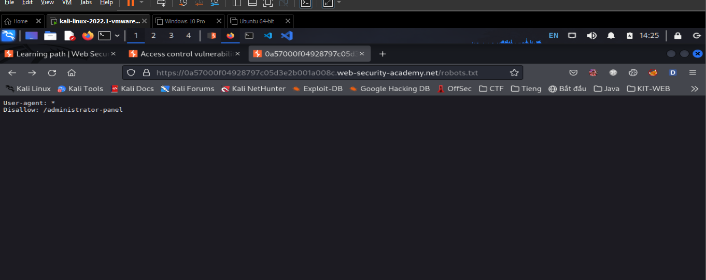

# Access control (Kiểm soát truy cập & leo thang đặc quyền)

## Kiểm soát truy cập là gì? (Access control)

> `Access Control` (authenrization) là việc áp dụng ràng buộc với ai hoặc cái gì có thể thực hiện các hành động cố gắng hoặc truy xuất tài nguyên.
>
> - `Autherization` người dùng và confirm chính là họ
> - `Session management` xác định các yêu cầu `HTTP` nào đang được thực hiện
> - `Access control` xác định người dùng xem có được quyền truy cập

> `Broken access control` là 1 vul thường gặp và nghiêm trọng. Thiết kế và quản lí `access control` là 1 vấn đề phức tạp

> Từ góc độ người dùng `access control` được chia thành:
>
> - Kiểm soát truy cập dọc (Vertical access control)
> - Kiểm soát truy cập ngang (Horizontal access control)
> - Kiểm soát truy cập phụ thuộc vào ngữ cảnh (Context-depement access control)

### Vertical access controls

> Là cơ chế hạn chế truy cập vào function sensitive không có sẵn cho người dùng.
>
> Với `Vertical access control`, user khác nhau có quyền truy cập vào các function ứng dụng khác nhau
>
> Ví dụ: qtv có thể sửa, xóa bất kì tài khoản của user nào, trong khi user bình thường không có các chức năng này

### Horizontal access controls

> Là cơ chế hạn chế truy cập vào tài nguyên đối với user được phép truy cập vào tài nguyên đó
>
> User khác nhau được phép truy cập vào tập hợp con các tài nguyên cùng loại
>
> Ví dụ:

### Context-dependent access controls

> Hạn chế quyền truy cập vào function, tài nguyên dựa trên trạng thái của ứng dụng hoặc tương tác của user với nó
>
> Ngăn chặn người dùng thực hiện hành động không đúng thứ tự
>
> Ví dụ:
> web bán lẻ ngăn người dùng sửa đổi nội dung trong giỏ hàng sau khi họ đã thanh toán

## Examples of broken access controls

### Vertical privilege escalation

> Nếu người dùng có thể truy cập vào các chức năng không được phép, đó là sự leo thang độc quyền

#### Unprotected functionality

> Cơ bản, sự leo thang độc quyền theo chiều dọc phát sinh khi ứng dụng không thực thi bất kì biện pháp bảo vệ nào đối với các chức năng nhạy cảm
>
> Ví dụ: Chức năng quản trị viên được liên kết từ trang chào mừng của quản trị viên nhưng không được liên kết với trang của user. User có thể vào thẳng path `/admin`:
>
> ```
> https://insecure-website.com/admin
> ```

#### Lab: Unprotected admin functionality

> Des: Lab chứa `admin panel` nhưng không được bảo vệ, xóa người dùng `carlos`

> Vào path với file `robots.txt`:
> 

> Làm theo nó:
>  
