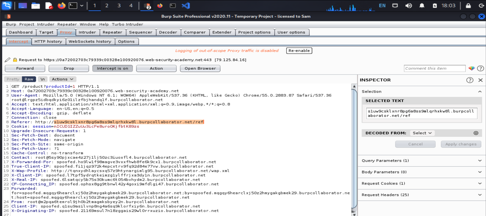

# Lỗ hổng SSRF (Server-side request forgery) - Giả mạo yêu cầu phía máy chủ

## Khái niệm

> SSRF là một vul web cho phép attacker tấn công khiến server thực hiện yêu cầu tới một vị trí không mong muốn
>
> Cuộc tấn công SSRF điển hình, attacker khiến máy chủ tạo kết nối với hệ thống, cơ sở hạ tầng (trong hoặc ngoài tùy ý), có khả năng rò rỉ dữ liệu

---

## Tác hại

> Cuộc attack SSRF thành công thường dẫn tới hành động truy cập trái phép vào dữ liệu, ứng dụng dễ bị attack nhất là phần `backend`
>
> Một số cuộc attack SSRF có thể cho phép kẻ attacker thực hiện lệnh tùy ý
>
> Cuộc tấn công SSRF kết nối với hệ thống thứ 3 bên ngoài dẫn tới các cuộc attack nguy hiểm bắt nguồn từ tổ chức lưu trữ ứng dụng

---

## Cuộc attack SSRF phổ biến

> Các cuộc attack SSRF thường khai thác các mối tin cậy (relationships) để leo thang đặc quyền

---

### SSRF attacks against the server itself (SSRF chống lại server)

> Cuộc tấn công SSRF chống lại server, attacker có thể khiến ứng dụng thực hiện yêu cầu quay lại máy chủ đang lưu trữ ứng dụng thông qua loopback network interface
>
> Ví dụ:
> Xem 1 ứng dụng shopping mua sắm liệu người dùng có được xem một mặt hàng có trong kho cụ thể hay không?
>
> Để cung cấp thông tin về kho, ứng dụng cần truy vấn REST API Back-end khác nhau, phụ thuộc vào sản phẩm và cửa hàng
>
> Vì vậy khi user xem trạng thái còn hàng của một mặt hàng sẽ truy vấn như sau:
>
> ```
> POST /product/stock HTTP/1.0
> Content-Type: application/x-www-form-urlencoded
> Content-Length: 118
>
> stockApi=http://stock.weliketoshop.net:8080/product/stock/check%3FproductId%3D6%26storeId%3D1
> ```
>
> Điều này khiến máy chủ yêu cầu thực hiện yêu cầu đến URL được chỉ định, truy xuất trạng thái của sản phẩm
>
> Trong trường hợp này, attacker có thể chỉnh sửa URL
>
> ```
> POST /product/stock HTTP/1.0
> Content-Type: application/x-www-form-urlencoded
> Content-Length: 118
>
> stockApi=http://localhost/admin
> ```
>
> Ở đây thì server sẽ tìm và trả về content của `/admin` của URL

#### Lab: Basic SSRF against the local server (SSRF cơ bản)

> Des: Lab này chứa tính năng kiểm tra data, lấy dữ liệu từ hệ thống nội bộ
> Mục tiêu: Thay đổi URL kiểm tra data để access vào admin interface tại `http://localhost/admin` và delete user `carlos`

**Giao diện ban đầu**


> Để check sản phẩm thì `checkstock`:
> 

> Dùng burp để chặn request và sửa `stockUrl` của đề
> 

> Send to repeater, sửa `stockApi` là `http://localhost/admin`:
> 

> Server sẽ trả về:
> 

> Sửa theo nó:
> 

> Done:
>  

---

### SSRF attacks against other back-end systems (SSRF chống lại hệ thống backend)

> Các trust relationship thường được phát sinh với giả mạo từ phía server là nới server app có thể tương tác với các hệ thống backend khác mà user không được quyền truy cập trực tiếp
>
> Các hệ thống này thường có địa chỉ IP riêng không được định tuyến.
>
> Ở ví dụ trước, giả sử giao diện quản trị tại URL backend: `http://192.168.0.68/admin` thì attacker có thể khai thác SSRF để exploit:
>
> ```
> POST /product/stock HTTP/1.0
> Content-Type: application/x-www-form-urlencoded
> Content-Length: 118
>
> stockApi=http://192.168.0.68/admin
> ```

#### Lab: Basic SSRF against another back-end system

> Des: Lab này có tình năng kiểm tra sản phẩm xem có còn hay không, để solve thì quét tại IP `192.168.0.x` với path là `/admin`

**Giao diện ban đầu**


> Dùng Burp Suite để chặn, bắt request:
> 

> Send nó qua Intruder và chỉnh payload:
> 

> 

> Sau đó attack và thấy Status là `200` thì lấy nó, chứng tỏ IP đó đúng:
> 

> DONE:
>  

---

## Circumventing common SSRF defenses (Phá vỡ hệ thống phòng thủ SSRF)

### SSRF with blacklist-based input filters

> Một số ứng dụng block input chứa hostname như `127.0.0.1` và localhost hoặc các URL nhạy cảm như `/admin`
>
> Với case này thì có thể phá vỡ filter bằng các tech khác nhau:
>
> 1. Sử dụng IP representation thay thế của `127.0.0.1` ví dụ như: `2130706433`, `017700000001` hoặc `127.1`
> 2. Đăng kí tên miền riêng của `127.0.0.1` chẳng hạn như đăng kí `spoofed.burpcollaborator.net`
> 3. Làm xáo trộn các chuỗi bị block bằng cách sử dụng mã URL hoặc biến chữ hoa thành thường

#### Lab: SSRF with blacklist-based input filter

> Des: Lab này có tính năng check sản phẩm, để solve đổi URL thành `http://localhost/admin` và delete user `carlos`
>
> Dev đã triển khai hệ thống phòng thủ SSRF yếu, cần vượt qua

**Giao diện ban đầu**


> Thử test thì nó đã bị chặn:
> 

> Vì nó đã filter nên phải bypass nó, tìm được cái này:
> 

> Dùng luôn =)):
> 
> Vẫn không được =((, đọc lại thì bài nó triển khai 2 cái def

> Chắc nó bị block strings, double-url encoding

> Double Endcoding là một kỹ thuật bao gồm mã hóa các tham số của người dùng 2 lần ở dạng hex để bypass qua security control hoặc gây ra các hành vi không mong muốn
>
> Điều này có thể xảy ra vì server web chấp nhận và xử lí các yêu cầu của client ở nhiều dạng encode
>
> Attacker có thể đưa double encoding vào pathnames hoặc query string để bypass qua authentication và security filter
>
> Ví dụ:
>
> - hex encoding: `../` -> `%2E%2E%2F`
> - then encoding: `%` -> `%25`
> - double encoding: `../` -> `%252E%252E%252F`

> -> path `http://127.1/admin` => `http://127.1/%2561dmin`
>
> Vì hex của `a` là `61`, double nó lên sẽ là `%2561`

> DONE
>   

---

#### SSRF with whitelist-based input filters

> Một số ứng dụng chỉ cho phép input phù hợp, bắt đầu hoặc chứa trong whitelist
>
> Case này, đoi khi có thể phá vớ filter bằng cách exploit sự mâu thuẫn trong phân tích cú pháp
>
> - Có thể nhúng thông tin đăng nhaajpa trức tên hostname, sử dụng ký tự `@` ví dụ: `https://expected-host@evil-host`
> - Có thể sử dụng `#` để phân đoạn URL ví dụ: `https://evil-host#expected-host`
> - Sử dụng leverage đặp tên cho `DNS` ví dụ: `https://expected-host.evil-host`
> - Sử dụng ký tự `URL-encode` để gây nhầm lẫn với `URL-parsing`

#### Lab: SSRF with whitelist-based input filter

> Des: Lab này có tính năng kiểm tra sản phẩm, để solve đổi URL thành `http://localhost/admin` và xóa `carlos`
>
> Dev đã deployed tính năng `anti-ssrf`, cần bypass

**Giao diện ban đầu**


> Test:
> 

> Trường hợp 1 trên docs: `https://expected-host@evil-host` > 
> -> Không thể connect

> Sang case 2: `https://evil-host#expected-host` 

> OK, thử double-encode:
>    

---

### Bypassing SSRF filters via open redirection

> Đôi khi bất kì loại phòng thủ nào dựa trên filter bằng cách open redirection vul
>
> Ví dụ SSRF bài trước, giả sử URL do người được xác thực nghiêm ngặt chặn hành vi SSRF khai thác có hại
>
> Tuy nhiên, ứng dụng có URL được phép chứa lỗ hổng open redirection vul. Với điều kiện API được sử dụng để thực hiện yêu cầu HTTP sau đó hộ trợ redirection, có thể tạo 1 URL để đáp ứng filter dẫn tới yêu cầu redirection tới mục tiêu mong muốn

> Ví dụ:
>
> ```
> /product/nextProduct?currentProductId=6&path=http://evil-user.net
> ```

> return:
>
> ```
> http://evil-user.net
> ```

> Có thể tận dụng vul open redirection để bypass qua URL và exploit SSRF như sau:
>
> ```
> POST /product/stock HTTP/1.0
> Content-Type: application/x-www-form-urlencoded
> Content-Length: 118
>
> stockApi=http://weliketoshop.net/product/nextProduct?currentProductId=6&path=http://192.168.0.68/admin
> ```

> Khai thác SSRF hoạt động: ứng dụng sẽ xác thực trước rằng URL `stockAPI` được cấp trên miền được cho phép.
>
> Sau đó ứng dụng yêu cầu URL được cấp, URL sẽ được kích hoạt và redirection

#### Lab: SSRF with filter bypass via open redirection vulnerability

> Des: Lab này chứa tính năng kiểm tra data, để solve thì truy cập URL: `http://192.168.0.12:8080/admin` và delete user `carlos`
>
> stock checker đã bị hạn chế truy cập local application.

**Giao diện ban đầu**


> Làm theo hướng dẫn :
>  

---

### Blind SSRF vulnerabilities

#### What is blind SSRF?

> `Blind SSRF vul` phát sinh khi một ứng dụng được tạo ra để đưa ra một `HTTP request` tới một `URL` cung cấp, nhưng phản hồi từ `HTTP request` không được `response` của `front-end application`

#### Tác động (What is the impact of blind SSRF vulnerabilities?)

> Thấp hơn so với `SSRF` được đẩy từ thông báo vì tính chất 1 chiều
>
> Chúng không thể bị khai thác một cách tầm thường để lấy dữ liệu sensitive từ các hệ thống `back-end`. Nhưng 1 số tình huống sẽ bị `rce`

---

#### Cách tìm và khai thác (How to find and exploit blind SSRF vulnerabilities)

> Cách để tìm ra `Blind SSRF` là sử dụng các kỹ thuật `out-of-band` (OAST) techniques.
>
> Điều này liên quan tới việc cố gắng kích hoạt 1 `HTTP Request` bên ngoài mà mình kiểm soát và giám sát tương tác network với hệ thống
>
> Có thể sử dụng `Burp Collaborator` để exploit hoặc các ứng dụng khác

---

#### Lab: Blind SSRF with out-of-band detection

> Des: Lab này sử dụng `fetch URL` được `Refere header` khi sản phẩm được load
>
> Để solve thì dùng `Burp Collaborator`

> path:
> 

> Sử dụng `Burp Colla`:
> 

> Sau khi copy sẽ paste vào `Referer`:
> 

> `Pull now` 

> Đơn giản chỉ cần xác định một `vul Blind SSRF` có thể kích hoạt `out-of-band HTTP`, bản thân nó cũng không cung cấp một tuyến đường dẫn tới khả năng exploit
>
> Vì không thể xem response từ `back-end request`
>
> Tuy nhiên vẫn có thể tận dụng các vul bảo mật khác trên máy chủ or hệ thống khác
>
> Có thể scan `IP address`, gửi các payload được thiết kế để detect các vul lớn

#### Lab: Blind SSRF with Shellshock exploitation

> Des: Site này chứa phần mềm phân tích fetch URL đc chỉ định `Referer` header
>
> Để solve thì dùng `Blind SSRF` để exploit. IP: `192.168.0.x:8080`, dùng payload `ShellShock` để lấy tên của OS user

> Đầu tiên thì cài thêm `Collaborator EveryWhere`:
> 

> Lấy path của lab rồi `add to scope` để nó quét lỗi:
> 

> Chuyển sang `off` để không chặn `request` để check các button có thể:
>    

> Dùng `Burp Collaborator client`:
> 

> Chặn `request` rồi `send to Intruder`:
> 

> Sửa `payload`:
> 

> Đề bảo tìm `name` của tên `OS-user`:
> 

> DONE:
> 

> Một cách `exploit blind SSRF` khác là khiến app kết nối với system dưới sự kiểm soát của `hacker` và `response` mã độc cho `client` connect.
>
> Nếu có thể exploit vul nghiêm trọng của `client` trong quá trình triển khai `server HTTP`, thì có thể thực hiện `rce` trên cơ sở hạ tầng `app`

---

### Finding hidden attack surface for SSRF vulnerabilities (Tìm bề mặt tấn công ẩn cho các lỗ hổng SSRF)

> Nhiều vul giả mạo yêu cầu server tương đối dễ phát hiện vì lưu lượng truy cập thông thường của ứng dụng liên quan tới các tham số chứa đầy đủ `URL`. Ví dụ khác về `SSRF` khó xác định

> 1. Partial URLs in requests (URL một phần trong yêu cầu):
>
>    Đôi khi app chỉ đặt tên server hoặc 1 phần của đường dẫn `URL` vào các `param` yêu cầu. Giá trị đã gửi sau đó sẽ kết hợp với phía `server` để tạo thành `URL` đầy đủ được yêu cầu.
>
> 2. URLs within data formats:
>    1 số app truyền dữ liệu ở dạng có đặc điểm kỹ thuật bao gồm `URLs` có thể được trình phân tích cú pháp dữ liệu yêu cầu cho định dạng. 1 dữ liệu điển hình là `XML`. Nó được sử dụng để truyền dữ liệu web từ `client` -> `server`. Nhưng có thể bị chèn `XXE`, do đó bị `SSRF` thông qua `XXE`
>
> 3. SSRF via the Referer header
>    1 số app sử dụng phần mềm phân tích server để `tracking` khách truy cập. app này thường ghi lại `Referer` header tại yêu cầu. Thường thì phần mềm phân tích sẽ được truy cập bất kì `URLs` nào của bên thứ 3 trong `Referer` header. Do đó nó dễ bị `SSRF`
